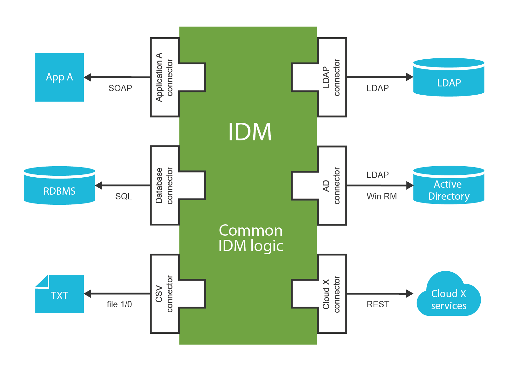
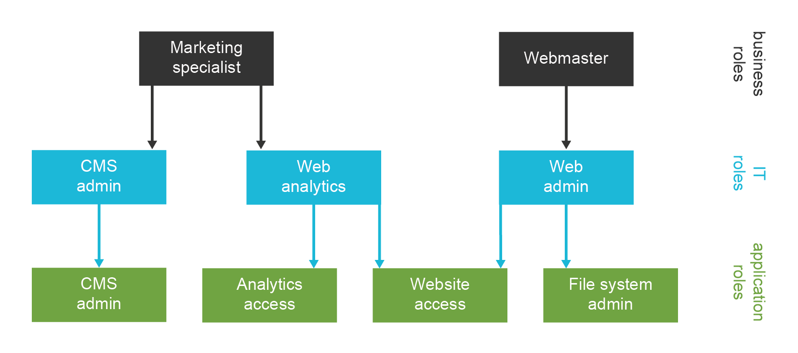

== Understanding Identity and Access Management

[quote, Frank Herbert]
The beginning of knowledge is the discovery of something we do not understand.

What is identity and access management?
Answer to that question is both easy and very complex.
The easy part is: Identity and access management (IAM) is a set of information technologies that deal with identities in the cyberspace.
The complex part of the answer takes the rest of this book.

This book deals mostly with _Enterprise Identity and Access Management_.
That is identity and access management applied to larger organizations such as enterprises, financial institutions, government agencies, universities, health care, etc.
The focus is on managing employees, contractors, customers, partners, students and other people that cooperate with the organization.
However, many of the mechanisms and principles described in this book can be applied to non-enterprise environments.

The story of identity and access management starts with information security.
The security requirements dictate the need for authentication and authorization of the users.
Authentication is a mechanism by which the computer checks that the user is really the one he pretends to be.
And authorization is a related mechanism by which the computer determines whether to allow of deny specific action to a user.
Almost every computer system has some means of authentication and authorization.

Perhaps the most widespread form of authentication is a password-based "log in" procedure.
The user presents an identifier and a password.
The computer checks whether the password is valid.
For this procedure to work the computer needs an access to the database of all valid users and passwords.
Early stand-alone information systems had their own databases that were isolated from the rest of the cyberspace.
The data were maintained manually.
But the advent of computer networking changed everything.
Users were able to access many systems and the systems themselves were connected to each other.
Maintaining an isolated user database in each system no longer made much sense.
And that's where the real story of digital identity begins.

=== Directory Services and Other User Databases

The central concept of identity management is a data record that contains information about a person.
This concept has many names: user profile, persona, user record, digital identity and many more.
The most common name in the context of identity management is _user account_.
Accounts usually hold the information that describes the real-world person using a set of attributes such as given name and family name.
But probably the most important part is the technical information that relates to operation of an information system for which the account is created.
This includes operational parameters such as location of users home directory, wide variety of permission information such as group and role membership, system resource limits and so on.
User accounts are represented in a wide variety of forms ranging from relational database records through structured data files to semi-structured text files.
But regardless of the specific method used to store and process the records the _account_ is undoubtedly one of the most important concepts of IAM field.
And so are the databases where the accounts are stored as accounts, being data records, have to be stored somewhere.

The account databases are as varied as are the account types.
Most account databases in the past were implemented as an integral part of the monolithic information system using the same database technology as the system itself used.
This is an obvious choice and it remains very popular even today.
Therefore many accounts are stored in relational database tables and similar application data stores.

Application data stores are usually tightly bound to the application.
Therefore accounts stored in such databases are difficult to share with other applications.
However, sharing account data across the organization is more than desirable.
It makes very little sense to maintain account data in each database separately – especially if most the accounts are the same in each application.
Therefore there is a strong motivation to deploy account databases that can be shared by many applications.

Shared data storage is the purpose of directory servers.
While application databases usually use their own proprietary protocol, _directory servers_ implement standardized protocols.
While databases are built for completely custom data model, directory servers usually extend standardized data model which improves interoperability.
While databases are often heavyweight and expensive to scale, directory servers are lightweight and designed for massive scalability.
That makes directory servers ideal candidates for shared account database.

Shared identity store is making user management easier.
An account needs to be created and managed in one place only.
Authentication still happens in each application separately.
But as the applications use the same credentials from the shared store, the user may use the same password for all the connected applications.

Lightweight Directory Access Protocol (LDAP) is a standard protocol for directory service access.
It is an old protocol when judging by Internet age standards.
LDAP roots are going as far back as 1980s to a family of telecommunication protocols known as X.500. Even though LDAP may be old it is far from being obsolete.
Quite the contrary.
It is a very efficient binary protocol that was designed to support massively distributed shared databases.
It has small set of well defined simple operations.
The operations and the data model implied by the protocol allow very efficient data replication and horizontal scalability of directory servers.
This allows low latencies and extreme throughput for read operations.
The horizontal scalability and relative autonomy of directory server instances increase the availability of the directory system.
These benefits often come at the expense of slow write operations.
But as identity data are often read but seldom modified this is usually a perfectly acceptable trade-off.
Therefore LDAP-based directory servers were and still remain the most popular databases for identity data.

LDAP is one of the precious few established standards in the IAM field.
And almost all organizations store identities in LDAP-enabled data stores.
Therefore we will be getting back to the LDAP protocol many times in this book.

Identity management solutions based on shared directory servers are simple and quite cost-efficient.
Therefore we have been giving the same advice for many years: if you can connect all your applications to an LDAP server, do not think too much about it and just do it.
The problem is that this usually works only for very simple systems.

=== Directory Servers are Databases

Directory servers are just databases that store information.
Nothing more.
The protocols and APIs used to access directory servers are designed as database interfaces.
It means that they are excellent for _storing, searching and retrieving_ data.
While the user account data often contain entitlement information (permissions, groups, roles, etc.), identity stores are not well suited to _evaluate_ them.
I.e. directory server can provide information what permissions an account has but it is not designed to make a _decision_ whether to allow or deny a specific operation.
And that is not all.
Directory servers do not contain data about user _sessions_.
It means that directory servers do not know whether user is currently logged in or not.
Many directory servers are used for basic authentication and even authorization.
But the directories were not designed to do it.
Directory servers provide only the very basic capabilities.
There are plug-ins and extensions that provide partial capabilities to support authentication and authorization.
But that does not change the fundamental design principles.
Directory servers are databases, not authentication or authorization servers.

=== Single Directory Server Myth

Shared directory server makes user management easier.
But this is not a complete solution and there are serious limitations to this approach.
The heterogeneity of information systems makes it nearly impossible to put all required data into a single directory system.

The obvious problem is the lack of a single, coherent source of information.
There are usually several sources of information for a single user.
For example a human resources (HR) system is authoritative for the existence of a user in the enterprise.
But the HR system is usually not authoritative for assignment of employee identifier such as _username_.
There needs to be an algorithm that ensures uniqueness of the username, possibly including uniqueness across all the current and past employees, contractors and partners.
And there may be additional sources of information.
For example Management information system may responsible for determination of user's roles (e.g. in project-oriented organizational structure).
Inventory management system may be responsible for assigning telephone number to the user.
The groupware system may be an authoritative source of the user's e-mail address and other electronic contact data.
There are usually 2 to 20 systems that provide authoritative information for a single user.
Therefore there is no simple way how to feed and maintain the data in the directory system.

And then there are spacial and technological barriers.
Many complex applications need local user database.
They must store the copies of user records in their own databases to operate efficiently.
For example, large billing systems cannot work efficiently with external data (e.g. because of a need to make relational database _join_).
Therefore even if directory server is deployed these applications still need to maintain a local copy of identity data.
Keeping the copy synchronized with the directory data may seem like a simple task.
But it is not.
And there are legacy systems which usually cannot access the external data at all (e.g. they do not support LDAP protocol).

Some services need to keep even more state than just a simple database record.
For example file servers usually create home directories for users.
While the account creation can usually be done in on-demand fashion (e.g. create user directory at first user log-on), the modification and deletion of the account is much more difficult.
Directory server will not do that.

But perhaps the most painful problem is the complexity of access control policies.
Role names and access control attributes may not have the same meaning in all systems.
Different systems usually have different authorization algorithms that are not mutually compatible.
While this issue can be solved with per-application access control attributes, the maintenance of these attributes is seldom trivial.
And if every application has its own set of attributes to control access control policies then the centralized directory does provide very little advantage.
The attributes may as well reside in the applications themselves.
And that's exactly how most deployments end up.
Directory servers only contain groups that roughly approximate RBAC roles.
And even LDAP standards themselves do not make this situation very easy.
There are at least three or four different and incompatible specifications for group definition in LDAP directories.
The usual approach to LDAP groups is not ideal at all and it has problems with big groups.
Therefore many directory servers provide their own non-standard improvements.
But even those improvements cannot support complex access control policies.
Therefore access control policies and fine-grained authorizations are often maintained directly in the application databases.

Single directory approach is feasible only in very simple environments or in almost entirely homogeneous environments.
In all other cases there is a need to supplement the solution by other identity management technologies.

This does not mean that the directory servers are useless.
Quite the contrary.
They are very useful when used properly.
They just cannot be used alone.
More components are needed to build a complete solution.

=== Access Management

While directory systems are not designed to handle complex authentication the _access management_ (AM) systems are built to handle just that.
They handle all the flavors of authentication and some authorization aspects.
The principle of all access management systems is basically the same:

. Access management system gets between the user and the target application.
This can be done by a variety of mechanisms but the most common is that the applications themselves redirect the user to the AM system if they do not have existing session.

. Access management system prompts user for username and password, requests the certificate, creates a challenge and prompts for the response or in any other way initiates the authentication procedure.

. User enters the credentials.

. Access management system checks the validity of credentials and evaluates access policies.

. If access is allowed then the AM system redirects user back to the application.
The redirection usually contains an access token: small piece of information that tells the application that the user is authenticated.

. Application validates the token, creates local session and allows the access.

After that procedure the user works with the application normally.
So only the first access goes through the AM server.
This is important for AM system performance and sizing.

The applications only need to provide code that integrates with the AM system.
Except for that small integration code applications do not need to provide any authentication code at all.
It is the AM system that prompts for password, not the application.
This is a fundamental difference when compared to LDAP-based authentication.
In the LDAP case it is the application that prompts for password.
In the AM case the Access Management server does everything.
Many applications do not even care how the user was authenticated.
All they need to know is that he was authenticated and that the authentication was good enough.
This feature brings a very desirable flexibility to the entire application infrastructure.
The authentication mechanism can be changed at any time without disrupting the applications.
We live in an era when passwords are migrated to a stronger authentication mechanisms.
The flexibility that the AM-based approach brings may play a key part in that migration.

=== Web Single Sign-On

Single Sign-On (SSO) systems allow user to authenticate once and then access number of different system.
There many SSO systems for web applications, however it looks like these systems are all using the same basic principle.
The web SSO is based on the general access management principle described above:

. Application A redirects the user to the access management server (SSO server).

. The access management server authenticates the user.

. The access management server establishes session (SSO session) with the user browser.
This is the crucial part of the SSO mechanism.

. User is redirected back to the application A. Application A usually establishes local session with the user.

. User interacts with application A

. When user tries to access application B, the application B redirects user to the access management server.

. The access management server checks for existence of SSO session.
As the user authenticated with the access management server before, there is a valid SSO session.

. Access management server does not need to authenticate the user again and immediately redirects user back to application B.

. Application B establishes local session with the user and proceeds normally.

The user usually does not even realize that he was redirected when accessing application B.
There is no interaction between the redirects and the redirects and the processing on the access management server is usually very fast.
It looks like the user was logged into the application B all the time.

image::pictures/1-4-web-sso-flow.png[Web SSO flow]

=== Authorization in Access Management

The request of a user accessing an application is directly or indirectly passed through the access management server.
Therefore the access management server can, in theory, analyze the request and evaluate whether the user request is authorized or not.
That is a theory.
But the situation is much more complicated in practice.

The AM server usually intercepts only the first request to access the application because it would be a performance impact to intercept all the requests.
After the first request the application established local sessions and proceeds with the operation without any communication with the AM server.
Therefore the AM server can only evaluate authorization during the first request.
Which means it can only evaluate a very rough-grained authorization decisions.
In practice it usually means that the AM server can make only all-or-nothing authorization decisions: whether a particular user can access all parts of a particular application or that he cannot access the application at all.
The AM server usually cannot make any finer-grain decisions just by itself.

Some AM systems provide agents that can be deployed to applications and that enforce a finer-grain authorization decisions.
Such agents often rely on HTTP communication and they are making decisions based on the URLs that the user is accessing.
This approach might work well in 1990s, but it has only very limited applicability in the age of single-page web applications and mobile applications.

Sophisticated applications often need to make authorization decisions based on context which is simply not available in the request or user profile at all. E.g. an e-banking application may allow or deny a transaction based on the sum of previous transactions that were made earlier that day.
While it is usually possible to synchronize all the authorization information into the user profile, it is usually not desirable.
It would be a major burden to keep such information updated and consistent.

AM systems often come with a promise to unify authorization across all the applications and to centralize management of organization-wide security policies.
Unfortunately, such broad promises are almost always false.
The AM system can theoretically evaluate and enforce some authorization statements.
And this may work well during demonstrations and in very simple deployments.
But in complex practical deployments this capability is extremely limited.
Vast majority of the authorization decisions is carried out by each individual application and is completely outside of the reach of an AM system.

=== SAML and OpenID Connect

Many access management systems use proprietary protocols to communicate with the applications and agents.
This is obviously an interoperability issue – especially when the AM principles are used in the Internet environment.
And it is the Internet that motivated standardization in this field.

The first widespread standardized protocol in this field was Security Assertion Markup Language (SAML).
The original intent of SAML was to allow cross-domain sign-on and identity data sharing across organizations on the Internet.
It is quite complex protocol and security token format heavily based on XML standards.
SAML philosophy and design is very close to the SOAP-based web services and in fact it was designed to integrate easily into the SOAP web service world.
SAML specifications are long, divided into several profiles, there are many optional elements and features and overall SAML is a set of very rich and flexible mechanisms.

Primary purpose of SAML is transfer of identity information between organizations.
There are big federations with hundreds of organizations based on SAML tokens and protocols.
Many e-government solutions are based on SAML, there are big partner networks running on SAML and overall it looks like SAML is a success.
But SAML was a victim of its own flexibility and complexity.
And the latest fashion trends are not very favorable to SAML. XML and SOAP-based web service mechanisms are getting out of fashion.
All of that has probably motivated the inception of other protocols.

The latest fashion favors RESTful services and similar simpler architectural approaches.
All of that probably contributed to the development of OpenID Connect protocol (OIDC).
OpenID Connect is based on much simpler mechanisms than SAML, but it is reusing the same basic principles.
OpenID connect has a very eventful history.
It all started with a bunch of homebrew protocols such as LID or SXIP that are now mostly forgotten.
That was followed by the development of OpenID protocol, which was still very simple.
OpenID gained some attention especially with providers of Internet services.
But despite its simplicity OpenID was not very well engineered and it quickly reached its technological limits.
It was obvious that OpenID needs to be significantly improved.
Then there was almost unrelated protocol called OAuth which was designed for management of cross-domain authorizations.
That protocol was developed into something that was almost, but not quite, entirely unlike the original OAuth protocol.
As the result had almost nothing to do with the original OAuth protocol it is perfectly understandable that is was dubbed OAuth2. And in fact OAuth2 is not really a protocol at all.
It is rather a vaguely-defined framework to build other protocols.
OAuth2 framework was used to build a cross-domain authentication and user profile protocol.
This new protocol is much more similar to SAML than to the original OpenID, so it was an obvious choice to call it OpenID Connect.
Some traditions are just worth maintaining.

Now there are two protocols that are using the same principle and do almost the same thing.
The principle is illustrated in the following diagram.

image::pictures/1-5-saml-oidc-flow.png[SAML/OIDC flow]

The interaction goes like this:

. User is accessing a resource.
This can be web page or web application on the target site.

. Target site does not have a valid session for the user.
Therefore it redirects user browser to the source site.
It will add authentication request into that redirect.

. Browser follows the redirect to the source site.
The source site gets the authentication request and parses it.

. If the user is not already authenticated with the source site then the authentication happens now.
The source site prompts for username, password, certificate, one-time password or whatever credential that is required by the policy.
With a bit of luck the authentication succeeds.

. The source site redirects the browser back to the target site.
The source site adds authentication response to the redirect.
The most important part of the response is a token.
The token directly or indirectly asserts user's identity.

. The target site will parse the authentication response and process the token.
The token may by just a reference to the real token (SAML artifact) or it may be access key to another service that provides the identity (OIDC UserInfo).
In that case the target site makes another request (6a).
This request is usually a direct one and does not use browser redirects.
One way or another, the target site now has claims about user identity.

. Target site evaluates the identity, processes authorizations and so on.
Local session with the user is usually established at this point to skip the authenticaiton redirects on the next request.
The target site finally provides the content.

Following table compares the terminology and technologies used in SAML and OIDC worlds.

[cols=3*,options=header]
|===
|
|SAML World
|OpenID Connect World

|Source site
|Identity Provider (IdP)
|Identity Provider (IDP) or OpenID Provider (OP)

|Target site
|Service Provider (SP)
|Relying Party (RP)

|Token
|SAML Assertion (or artifact)
|ID token, access token

|Intended for
|Web applications, web services (SOAP)
|Web applications, mobile applications, REST services

|Based on
|N/A
|OAuth2

|Data representation
|XML
|JSON

|Cryptography framework
|XMLenc, XMLdsig
|JOSE

|Token format
|SAML
|JWT

|===

Careful reader will notice the similarity with the web-based access management mechanisms.
That's right.
This is the same wheel reinvented over and over again.
However, to be completely honest we have limited our description to cover flows for web browser only.
Both SAML and OIDC has broader applicability that just web browser flows.
And the differences between the protocols are much more obvious in these extended use cases.
But the web browser case nicely illustrates the principles and similarities of SAML, OpenID Connect and also the simple web-SSO systems.

Maybe the most important differences between SAML, OIDC and web-SSO systems is the intended use:

* SAML was designed for the web applications and SOAP web services world.
It will handle centralized (single-IDP) scenarios very will, but it can also work in decentralized federations.
Go for SAML if you are using SOAP and WS-Security or if you plan to build big decentralized federation.

* OpenID Connect was designed mostly for use with social network and similar Internet services.
Its philosophy is still somehow centralized.
It will work well if there is one strong identity provider and many relying parties.
Technologically it will fit into RESTful world much better than SAML. Current fashion trends are favorable to OIDC.

* Web-SSO systems are designed to be used inside a single organization.
This is ideal to implement SSO between several customer-facing applications so the customers will have no idea that they interact with many applications and not just one.
The web-SSO systems are not designed to work across organizational boundaries.

Although SAML and OIDC are designed primarily for cross-domain use, it is no big surprise to see them inside a single organization.
There is a clear benefit in using an open standardized protocol instead of a proprietary mechanism.
However, it has to be expected that the SSO system based on SAML or OIDC will have slightly more complicated setup than a simple Web-SSO system.

=== Kerberos, Enterprise SSO and Friends

Many of us would like to think that everything is based on web technologies today and that non-web mechanisms are things of the past.
But there are still cases that are not web-based and where web-based SSO and AM mechanisms will not work.
There is still a lot of legacy applications, especially in the enterprise environment.
Applications based on rich clients or even character-based terminal interactions are still not that difficult to find.
And then there are network operating systems such as Windows and numerous UNIX variants, there are network access technologies such as VPN or 802.1X and so on.
There are still many cases where web-based access management and SSO simply won't work.

These technologies usually pre-date the web.
And honestly, the centralized authentication and SSO are not entirely new ideas.
Therefore it is perhaps no big surprise that there are authentication and SSO solutions even for non-web applications.

The classic classroom example of non-web SSO system is Kerberos.
The protocol originated at MIT in 1980s.
It is a single sign-on protocol for operating systems and rich clients based on symmetric cryptography.
Even though it is a cryptographic protocol it is not too complicated to understand and it definitely withstood the test of time.
It has been used to this day, especially for authentication and SSO of network operating systems.
It is a part of Windows network domain and it is often the preferred solution for authentication of UNIX servers.
The most serious limitation of Kerberos is given by its use of symmetric cryptography.
The weakness of symmetric cryptography is key management.
Kerberos key management can be quite difficult especially when Kerberos realm gets very big.
Key management is also one of the reasons why it is not very realistic to use Kerberos in cross-domain scenarios.
However inside a closed organization Kerberos is still a very useful solution.

The major drawback in using Kerberos is that every application and client needs to be "kerberized".
In other words everybody that wants to take part in Kerberos authentication needs to have Kerberos support in one's software.
There are kerberized versions of many network utilities so this is usually not a problem for UNIX-based networks.
But it is a problem for generic applications.
There is some support for Kerberos in common web browsers which is often referred to as "SPNEGO".
However this support is usually limited to interoperability with Windows domains.
Therefore even though Kerberos is still useful for operating system SSO it is not a generic solution for all applications.

Many network devices use RADIUS protocol for what network engineers call "Authentication, Authorization and Accounting" (AAA).
However RADIUS is a back-end protocol.
It does not take care of client interactions.
The goal of RADIUS is that the network device (e.g. WiFi access point, router or VPN gateway) can validate user credentials that it has received as part of other protocol.
The client connecting to VPN or WiFi network does not know anything about RADIUS.
Therefore RADIUS is similar to the LDAP protocol and it is not really an access management technology.

Obviously there is no simple and elegant solution that can provide SSO for all enterprise applications.
Despite that one technology appeared in 1990s and early 2000s and promised to deliver universal enterprise SSO solution.
It was called "Enterprise Single Sign-On" (ESSO).
The ESSO approach was to use agents installed on every client device.
The agent detects when login dialog appears on the screen, fills in the username and password and submits the dialog.
If the agent is fast enough the user does not even notice the dialog and this creates the impression of Single Sign-On.
However, there are obvious drawbacks.
The agents needs to know all the passwords in a cleartext form.
There are ESSO variations with passwords randomly generated or even single-user passwords which partially alleviates this problem.
But the drawback is that the ESSO also needs to be integrated with password management of all the applications, which is not entirely easy.
However the most serious drawback of ESSO are the agents.
These only work on workstations that are strictly controlled by the enterprise.
Yet the world is changing, enterprise perimeter has efficiently disappeared and the enterprise cannot really control all the client devices.
Therefore also ESSO is now mostly a thing of the past.

=== Access Management and the Data

Access Management servers and Identity Providers need to know the data about users to work properly.
But it is complicated.
The purpose of access management systems is to manage access of users to the applications.
Which usually means processing authentication, authorization (partially), auditing the access and so on.
For this to work, the AM system needs access to the database where the user data are stored.
It needs access to usernames, passwords and other credentials, authorization policies, attributes and so on.
The AM systems usually do not store these data themselves.
They rely on external databases.
And in vast majority of cases those databases are directory services.
This is an obvious choice: directory services are lightweight, highly available and extremely scalable.
The AM system usually need just a simple attributes, therefore the limited capabilities of directory data models are not a limiting factor here.
Marriage of access management and directory service is an obvious and very smart match.

However, there is one critical issue – especially if the AM system is also used as a single sign-on server.
The data in the directory service and the data in the applications must be consistent. E.g. it is a huge problem if one user has different usernames in several applications.
Which username should he use to log in?
Which username should be sent to the applications?
There are ways how to handle such situations, but this is usually very cumbersome and expensive.
It is much easier to unify the data before the AM system is deployed.

Even though the "M" in AM stands for "management", typical AM system has only a very limited data management capabilities.
The AM systems usually assume that the underlying directory system is already properly managed. E.g. a typical AM system has only a very minimalistic user interface to create, modify and delete user records.
Some AM systems may have self-service functionality (such as password reset), but even that functionality is usually very limited.
Even though the AM relies on the fact that the data in the AM directory service and the data in applications are consistent there is usually no way how to fully synchronize the data by using the AM system itself.
There may be methods for on-demand or opportunistic data updates, e.g. creating user record in the database when the user logs in for the first time.
But there are usually no solutions for deleting the records or for updating the records of inactive users.

Therefore the AM systems are usually not deployed alone.
The underlying directory service is almost always a hard requirement for even the most humble AM functionality.
But for the AM system to really work properly it needs something to manage and synchronize the data.
Identity Management (IDM) system is usually used for that purpose.
And in fact, it is usually strongly recommended to deploy the directory and the IDM system before the AM system.
The AM system cannot work without the data.
And if it works on data that are not maintained properly it will not take a long time until it fails.

=== Advantages and Disadvantages of Access Management Systems

Access management and web SSO systems have significant advantages.
Most of the characteristics are given by the AM principle of centralized authentication.
As the authentication is carried out by a central access management server it can be easily controlled and audited.
Such centralization can be used to consistently apply authentication policies - and to easily change them when needed.
It also allows better utilization of an investment into authentication technologies. E.g. multi-factor or adaptive authentication can be quite expensive if it has to be implemented by every application.
But when it is implemented in the AM server then it is re-used by all the applications without additional investment.

However there are also drawbacks.
As the access management is centralized it is obviously a single point of failure.
Nobody is going to log in in case that the AM server fails.
This obviously means major impact on functionality of all applications.
Therefore AM servers need to be highly available and scalable.
Which is not always an easy task.
The AM servers need a very careful sizing as they may easily become a performance bottlenecks.
But perhaps the most severe drawback is the total cost.
The cost of the AM server itself is usually not a major issue.
But the server needs to be integrated with every application.
Even though there are some standards the integration is usually quite painful.
Support for AM standards and protocols in the applications is far from being perfect.
Especially older enterprise applications need to be modified to switch their authentication subsystem to the AM server.
This is often so costly that the adoption of AM technologies is often limited just to a handful of enterprise applications.

Even though many enterprises are planning deployment of an AM system as their first step in the IAM project, this approach seldom succeeds.
The project usually plans to integrate 50-80% applications into the AM solution.
But the reality is that only a handful of applications is integrated with the AM system.
The rest of the applications is integrated using an IDM system that is hastily added to the project.
Therefore it is better to plan ahead: analyze the AM integration effort and make a realistic plan for the AM solution.
Make sure that the AM can really bring the promised benefits.
Starting with IDM and adding AM part later is often much more reasonable strategy.

=== Single Access Management Myth

The redirection approach of Access Management systems assumes that the user has something that can display authentication prompts and carry out user interaction.
Which is usually a web browser.
Therefore this approach applies mostly to conventional web-based applications.
Variations of this approach are also applicable to single-page web applications.
However this approach is usually not directly applicable for applications that use rich clients, operating system authentication and mobile applications.
Browser is not the primary environment that can be used to carry out the authentication in those cases.
There are some solutions that usually rely on embedded browser, however that does not change the basic fact that the AM technologies are not entirely suitable for this environment.
These applications usually rely on Kerberos as an SSO system or do not integrate with any SSO system at all.

As typical enterprise environment is composed of a wild mix of technologies and not all of them are entirely web-based.
Therefore it is unlikely that a single AM system can apply to everything that is deployed in the enterprise.
Authentication is very tightly bound to the user interaction, therefore it depends on the method how the user interacts with the application.
As the user is using different technologies to interact with the web application, mobile application and operating system then it is obvious that also authentication and SSO methods for these systems will be different.

Therefore it has to be expected that there will be several AM or SSO systems in the enterprise, each one serving its own technological island.
And each island needs to be managed.

=== Practical Access Management

Unifying access management system, Single Sign-On, cross-domain identity federation, universally-applicable 2-factor authentication – there are the things that people usually want when they think about Identity and Access Management (IAM).
And these are all perfectly valid requirements.
However, everything has its cost.
And it is notoriously difficult to estimate the cost of access management solutions because majority of the cost is not in the AM software.
Huge part of the total cost is hidden inside existing applications, services and clients.
All of this has to be considered when planning an access management project.

Even though the AM is what people usually want, it is usually wise *not* to start with AM as the first step.
AM deployment has many dependencies: unified user database, managed and continually synchronized data, applications that are flexible enough to be integrated and so on.
Unless your IT infrastructure is extremely homogeneous and simple, it is very unlikely that these dependencies are satisfied.
Therefore it is almost sure that the AM project attempted at the beginning of the IAM program will not reach its goals.
And it is quite likely for such AM projects to fail entirely.
However if the AM project is properly scoped and planned and has realistic goals there is high chance of success and it can bring substantial value.

Perhaps the best way to evaluate an AM project is to ask several questions:

* Do I really need access management for all applications?
Do I need 100% coverage?
Can I afford all the costs?
Maybe it is enough to integrate just a couple of applications that are source of the worst pain.
Do I know which applications are these?
Do I know what my users really use during they workday?
Do I know what they need?

* Do I fully realize that the effect of AM and SSO is mostly user convenience?
What are the real security benefits of AM deployment?
Will I be disabling the native authentication to the applications?
Even for system administrators?
What will I do in case of administration emergencies (e.g. system recovery)?
Would system administrators still be able to circumvent the AM system?
If yes then what is the real security benefit?
If not then what will be the recovery procedure in case the AM system fails?

* Do I really need SSO for older and rarely used applications?
What is the real problem here?
Is the problem that users are entering the password several times per day?
Or is the real problem that they have to enter different username or password to different applications and they keep forgetting the credentials?
Maybe simple data cleanup and password management will solve the worst problems and I case save a huge amount of money on AM project?

The AM technologies are the most visible part of the IAM program.
But it is also the most expensive part and the most difficult to set up and maintain.
Therefore do not underestimate other IAM technologies and do not try to solve every problem with AM golden hammer.
Using the right tool for the job is a good approach in every situation.
But in IAM program it is absolutely critical for success.

=== Identity Management

_Identity management_ (IDM) is maybe the most overlooked and underestimated technology in the whole identity and access management (IAM) field.
Yet IDM is a crucial part of almost every IAM solution.
And it is IDM that can bring substantial benefits to almost any organization.
So, what that mysterious IDM really is?

Identity management is exactly what the name says: it is all about managing identities.
It is about the processes to create Active Directory accounts and mailboxes for a new employee.
IDM makes it possible to immediately disable all access to a suspicious user during a security incident.
IDM takes care of adding new privileges and removing old privileges of users during reorganization.
IDM makes sure that all the accounts are properly disabled when the employee leaves the company.
IDM records access privileges of temporary workers, partners, support engineers and all the third-party identities that are not maintained in your human resources (HR) system.
IDM automates the processes of role request and approval.
IDM records every change in user privileges in the audit trail.
IDM governs the annual reviews of roles and access privileges.
IDM makes sure the copies of user data that are kept in the applications are synchronized and properly managed.
And IDM does many other things that are absolutely essential for every organization to operate in an efficient and secure manner.

It looks like IDM is the best thing since the sliced bread.
So where's the catch?
Oh yes, there is a catch.
Or it is perhaps better to say that there was a catch.
The IDM systems used to be expensive.
Very expensive.
The IDM systems used to be so expensive that it was very difficult to justify the cost even with such substantial and clear benefits.
But that time is over now.

NOTE: The term _identity management_ is often used for the whole identity and access management (IAM) field.
This is somehow confusing because technologies such as single sign-on or access management do not really manage the identities.
Such technologies manage the access to the applications.
Even directory servers do not exactly _manage_ the identities.
Directory servers store the identities and provide access to them.
There is in fact one whole branch of technologies that manage identities.
Those systems are responsible for creating identities and maintaining them.
Those are sometimes referred to as _identity provisioning_, _identity lifecycle management_ or _identity administration systems_.
But given the current state of the technology such names are indeed an understatement.
Those systems can do much more than just provisioning or management of identity lifecycle.
We will refer to these systems simply as _identity management_ (IDM) systems.
When we refer to the entire field that contains access management, directory services, identity management and governance we will use the term _identity and access management_ (IAM).

Let's start at the beginning.
In 1990s there was no technology that would be clearly identified as "identity management".
Of course, all the problems above had existed almost since the beginning of modern computing.
And there had always been some solutions for those problems.
But most of that solutions were based on paperwork and scripting.
That worked quite well - until the big system integration wave spread through the industry in 1990s and 2000s.
As data and processes in individual applications got integrated, the IDM problems became much more pronounced.
Manual paper-based processes were just too slow for the age of information superhighways.
The scripts were too difficult to maintain in the world where new application is deployed every couple of weeks.
The identity integration effort naturally started with the state-of-the-art identity technology of the day: directory services.
But as we have already shown the directories were not ideal tool for the job.
The directories were not entirely suitable for environment where people though that LDAP is some kind of exotic disease, where usernames and identifiers were assigned quite randomly and where every application insisted that the only authoritative data are those stored in its own database.

=== First Generation

The integration problems motivated the inception of IDM technologies in early 2000s.
Early IDM systems were just data synchronization engines that were somehow hard-coded to operate with users and accounts.
Some simple Role-Based Access Control (RBAC) engines and administration interfaces were added a bit later.
During mid-2000s there were several more-or-less complete IDM systems.
This was the first generation of the IDM systems.
These systems were able to synchronize identity data between applications and also provide some basic management capabilities.
But even such a simple functionality was a huge success.
The IDM systems could synchronize the data without any major modification of the applications, therefore they brought the integration cost to a reasonable level.
The problem was that the cost of the IDM systems themselves was quite high.
And these systems were still somehow crude, therefore the configuration and customization required a very specialized class of engineers.
This made the deployment of IDM solutions prohibitively expensive for many mid-size and smaller organizations.
And even big organizations often deployed IDM solution with quite limited features to make the cost acceptable.
These IDM systems later evolved and improved.
And there were companion products for governance and compliance that augmented the functionality.
But it often was almost impossible to change the original architecture or a product.
Therefore many first-generation products still struggle with limitations that originated in the early product design.

All the first-generation IDM systems were commercial closed-source software.
Many of these products are still available on the market and they are even considered to be leaders.
However, the closed-source character of the IDM products is itself a huge problem.
Every IDM solution has to be more-or-less customized.
Which usually means more rather than less.
It has to be the IDM system that adapts and not the applications.
Requiring each application to adapt to a standardized IDM interface means a lot of changes in a lot of different places, platforms and languages.
The total cost adds up to a huge number.
Such approach is being tried from time to time but it almost always fails.
It is not a practical approach.
While there are many applications in the IT infrastructure, there is just one IDM system.
If the IDM system adapts to applications and business processes, the changes are usually smaller and they are all in one place and implemented in a single platform.
So the IDM system must be able to adapt.
And it has to adapt a great deal and it has to adapt easily and quickly.
Closed-source software is notoriously bad at adapting to requirements that are difficult to predict.
Which in practice means that the IDM projects based on first-generation products were hard, slow and expensive.
Also the closed-source software is prone to vendor lock-in.
Once the IDM system is deployed and integrated it is extremely difficult to replace it with a competing system.
The closed-source vendor is the only entity that can modify the system and the system cannot be efficiently replaced.
Which means that the end customer is not in a position to negotiate.
Which means high maintenance costs.
Naturally the first generation of IDM system was a huge commercial success.
But only for the vendors.
This generation of IDM solutions really worked only for some customers and even there the real long-term benefits were often questionable.

=== Second Generation

We can only speculate what were the reasons, but the fact is that around the years 2009-2011 several very interesting new IDM products appeared on the market.
One interesting thing is that all of them were more-or-less open source.
But there is much more.
Although all of the products are targeting the IDM space they are all significantly different.
They differ in their philosophy and governing principles.
One product is just a simple framework that can be programmed and extended ad nauseam while another product is a full-fledged IDM product with support for governance and compliance features.
Architecture of one product is quite heavyweight, based on Service-Oriented Architecture (SOA) principles.
And that product actually contains complete Enterprise Service Bus (ESB) embedded inside the system.
On the other hand, architecture of another product is a loosely coupled set of components that can be glued together with JavaScript.
Couple of other products are mostly based on proven and efficient lightweight Java architecture.
While some products are following good open source standards and they are building user communities, other products are open source only by the source code license and they are obviously not so much community-oriented.
So, there is a lot of variability.
Which means that are plenty options to choose from.

To be completely honest, not all second-generation IDM products are entirely ready for prime time.
It takes some time for a product to mature.
But there are few products that can handle all common IDM scenarios without any problems.
And at least one product is a comprehensive and feature-complete IDM system.
Some of the products stagnate and at least one product is practically dead.
But there are products that are actively maintained and continuously improved.

The most significant advantage of the second-generation IDM products is their open source character.
This is a characteristic that is easy to overlook, but it is almost impossible to overstate.
As every single IDM engineer knows, understanding of the IDM product and the ability to adapt the product are two critical aspects of any IDM project.
Open source is the best way to support both understanding and flexibility.
And there is also third important advantage: it is almost impossible to create a vendor lock-in situation with an open source product.
All of the open source products are backed by companies that offer professional support services that are equivalent to the services offered by commercial IDM products.
Therefore there are no disadvantages originating from the open source character of these projects.
Yet there are huge advantages that make this approach really revolutionary.

The second-generation IDM products are obvious choice for new IDM deployment projects.
The advantages of these products are quite clear and there is a great potential for future development.
However, as always, you must choose wisely.

=== What is This Identity Management, Anyway?

_Identity management_ is a simple term which encompasses a very rich and comprehensive functionality.
It contains identity provisioning (and reprovisioning and deprovisioning), synchronization, organizational structure management, role-based access control, data consistency, approval processes, auditing and few dozens of other features.
All of that is thoroughly blended and mixed with a pinch of scripting and other seasoning until there is a smooth IDM solution.
Therefore it is quite difficult to tell what identity management is just by using a dictionary-like definition.
We would rather describe what identity management is by using a couple of typical usage scenarios.

Let's have a fictional company called ExAmPLE, Inc.
This company has few thousand employees, decent partner network, customers and suppliers and all the other things as real-world companies have.
And ExAmPLE company has an IDM system running in its IT infrastructure.

ExAmPLE hires a new employee called Alice.
Alice signs an employee contract few days before she starts her employment.
The contract is entered into the HR system by the ExAmPLE HR staff.
The IDM system periodically scans the HR records and it discovers the record of a new hire.
The IDM systems pulls in the record and analyzes it.
The IDM system will take user's name and employee number from the HR record, it will generate a unique username and based on that information it creates a user record in the IDM system.
The IDM system also gets the organization code of `10010` from the HR record.
The IDM will look inside its organizational tree and discovers that the code `10010` belongs to sales department.
Therefore IDM will automatically assign the user to the sales department.
The IDM will also process the work position code of `S007` in the HR record.
The IDM policies say that the code `S007` means sales agent and that anybody with that code should automatically receive the "Sales Agent" role.
Therefore the IDM will assign that role.
As this is a core employee, the IDM will automatically create an Active Directory account for the user together with the company mailbox.
The account will be placed into the Sales Department organizational unit.
The "Sales Agent" role entitles the user to more privileges.
Therefore the Active Directory account is automatically assigned to sales groups and distribution lists.
The role also gives access to the CRM system, therefore CRM account is also automatically created and assigned to appropriate groups.
All of that happens in a couple of seconds after the new HR record is detected.
And it all happens automatically.

Alice starts her career and she is a really efficient employee.
Therefore she gets more responsibilities.
Alice is going to prepare specialized market analyses based on empirical data gathered in the field.
ExAmPLE is a really flexible company, always inventing new ways how to make business operations more efficient.
Therefore they invented this work position especially to take advantage of Alice's skills.
Which means there is no work position code for Alice's new job.
But she needs new privileges in the CRM system to do her work efficiently.
And she needs that right now.
Fortunately the ExAmPLE has a flexible IDM system.
Alice can log into the IDM system, select the privileges that she needs and request them.
The request has to be approved by Alice's manager and also by the CRM system owner.
They get the notification about the request and they can easily approve or reject it in the IDM system.
Once the request is approved Alice's CRM account will be automatically assigned to appropriate CRM groups.
Alice may start working on her analysis minutes or hours after she has requested the privileges.

image::pictures/01-07-example-idm-approval.png[ExAmPLE IDM approval]

Alice lives happily ever after.
And one day she decides to get married.
Alice, similarly to many other women, has the strange habit of changing her surname after the marriage.
But now Alice has a really responsible work position and she has accounts in a dozen information systems.
This is no easy task to change her name in all of them, is it?
In fact it is very easy because ExAmPLE has its IDM system.
Alice goes to the HR department and the HR staff changes her surname in the HR system.
The IDM system will pick up the change and propagate that to all the affected systems.
Alice even automatically gets a new e-mail address with her new surname (keeping the old one as an alias).
Alice will receive a notification that now she can use her new e-mail address.
The change is fast, clean and effortless.

Later that day Alice discovers that her password is about to expire.
Changing the password in all the applications would be a huge task.
But Alice knows what to do.
She logs into the IDM system and changes her password there.
The password change is automatically propagated to each affected system according to policy set up by the IT security office.

The following month something unexpected happens.
There is a security incident.
The security office discovered the incident and now they are investigating it.
It looks like it was an insider job.
The security officers are using the data from the IDM system to focus their investigation on users that had privileges to access affected information assets.
They pinpoint Mallory as a prime suspect.
The interesting thing is that Mallory should not have these privileges at all.
Luckily the IDM system also keeps an audit trail about every privilege change.
Therefore they discover that it was Mallory's colleague Oscar that assigned these privileges to Mallory.
Both men are to be interviewed.
But as this incident affects sensitive assets there are some preventive measures to be executed before any word about the incident spreads.
The security officers use the IDM system to immediately disable all the accounts that Mallory and Oscar have.
It takes just a few seconds for IDM to disable these accounts in all the affected applications.

The investigation later reveals that Oscar is mostly innocent.
Mallory misused Oscar's trust and tricked him to assign the extra privileges.
Mallory abused the privileges to get sensitive data and he tried to sell them.
The decision is that Mallory has to immediately leave the company while Oscar may stay.
However, as Oscar has shown poor judgment in this case his responsibilities are reduced.
The IDM is now used to permanently disable all Mallory's accounts, to re-enable Oscar's accounts and also to revoke sensitive privileges that are considered too risky for Oscar to have.

Few months later Oscar is still ashamed because of his failure.
He decides not to prolong his employee contract with ExAmPLE and to leave the company without causing more trouble.
Oscar's contract expires at the end of the month.
This date is recorded in the HR system and the IDM system takes it from there.
Therefore at midnight of the last Oscar's day at work the IDM system automatically deletes all Oscar's accounts.
Oscar starts a new career as a barman in New York.
He is very successful.

The security office has handled the security incident in a professional way and the IDM system provided crucial data to make the security response quick and efficient.
They receive praise from the board of directors.
But the team always tries to improve.
They try to learn from the incident and reduce the possibility of such a thing happening again.
The team is using data from the IDM system to analyze the privileges assigned to individual users.
The usual job of the IDM system is to create and modify accounts in the applications.
But the IDM system is using bidirectional communication with the applications.
Therefore this analysis is far from being yet another pointless spreadsheet exercise.
The analysis is based on real application data processes and unified by the IDM system: what are the real accounts, to which user they belong, what roles they have, which groups they belong and so on.
The IDM system can detect accounts that do not have any clear owner.
The security team discovers quite a rich collection of testing accounts that were obviously used during the last data center outage half a year ago.
The IT operations staff obviously forgot about these accounts after the outage.
The security staff disables the accounts using the IDM tools and sets up an automated process to watch out for such accounts in the future.

Based on the IDM data the security officers suspect that there are users that have too many privileges.
This is most likely a consequence of the request-and-approval process and these privileges simply accumulated over time.
But this is just a suspicion.
It is always difficult for a security staff to assess whether particular user should have certain privilege or should not have it.
This is especially difficult in flexible organizations such as ExAmPLE, where work responsibilities are often cumulated and organizational structures is somehow fuzzy.
Yet there are people that know what each employee should do: the managers.
However, there are many managers on many departments and it would be a huge task to talk to each one of them and consult the privileges.
The IDM system comes to the rescue once again.
The security officers set up automated access recertification campaign.
They sort all users to their managers based on the organizational structure which is maintained in the IDM system.
Each manager will receive an interactive list of their users and their privileges.
The manager must confirm (re-certify) that the user still needs those privileges.
This campaign is executed in a very efficient manner as the work is evenly distributed through the organization.
Therefore the campaign is completed in a couple of days.
At the end the security officers know which privileges are no longer needed and can be removed.
This reduces the exposure of the assets which is a very efficient way to reduce residual security risk.

NOTE: Experienced identity management professionals certainly realized that this description is slightly idealized.
The real world is not a fairy tale and real life with an IDM system is much more complicated that this simple story suggests.
Even though the real life is harder than a story in a book, the IDM system remains an indispensable tool for automation and information security management.

=== How Does Identity Management Technology Work?

Obviously identity management systems have a lot of advantages for business, processes, efficiency and all that stuff.
But how does it really works on a technological level?
The basic principle is very simple: identity management system is just a sophisticated data synchronization engine.

Identity management system takes data from the source systems, such as HR databases.
It is processing the data, mapping and transforming the values as necessary.
It will figure out which records are new.
The IDM engine will do some (usually quite complex) processing on the records.
That usually includes processing policies such as Role-Based Access Control (RBAC), organizational policies, password policies and so on.
The result of this processing is creation or modification of user accounts in other systems such as Active Directory, CRM systems and so on.
So basically it is all about getting the data, changing them and moving them around.
This does not seem very revolutionary, does it?
But it is all about the details.
It is the way how the IDM system gathers the data, how it is processing the data and how it is propagating the changes that make all the difference.

=== Identity Management Connectors

Identity management system must connect to many different applications, databases and information systems.
Typical IDM deployment has tens or even hundreds of such connections.
Therefore the ease of connecting IDM system with its environment is one of its essential qualities.

Current IDM systems use _connectors_ to communicate with all surrounding systems.
These connectors are based on similar principles that database drivers.
On one end there is unified connector interface that presents that data from all the systems using the same "protocol".
On the end of the connector is the native protocol that the application supports.
Therefore there are connectors for LDAP and various LDAP variants, SQL protocols and dialects, connectors that are file-based, connectors that invoke web services or REST services and so on.
Every slightly advanced IDM system has tens of different connects.

Connector is usually relatively simple piece of code.
Primary responsibility of a connector is to adapt communication protocols.
Therefore LDAP connector translates the LDAP protocol messages into data represented using a common connector interface.
The SQL connector does the same thing with SQL-based protocols.
The connector also interprets the operations invoked on the common connector interface by the IDM system.
Therefore the LDAP protocol will execute the "create" operation by sending LDAP "add" message to the LDAP server and parsing the reply.
Connectors usually implement the basic set of create-read-update-delete (CRUD) operations.
Therefore a typical connector is quite simple piece of code.
Despite its simplicity the whole connector idea is a clever one.
The IDM system does not need to deal with the communication details.
The core of the IDM system can be built to focus on the generic identity management logic which is typically quite complex just by itself.
Therefore any simplification that the connectors provide is more than welcome.

Connectors are usually accessing external interfaces of source and target systems.
It is natural that the connector authors will choose interfaces that are public, well-documented and based on open standards.
Many newer systems have interfaces like that.
But there are notorious cases that refuse to provide such interface.
Despite that there is almost always some way to build a connector.
The connector may create record directly in the application database.
Or it may execute a database routine.
Or it may execute a command-line tool for account management.
Or it may even do crazy things such as simulation of a user working with text terminal and filling out a form to create new account.
There is almost always a way to do what connector needs to do.
Just some ways are nicer than others.

The connector-based architecture is pretty much standard among all advanced IDM systems.
Yet the connector interfaces significantly vary from one IDM system to another.
Therefore the connectors are not interchangeable between different IDM systems.
The connector interfaces are all proprietary.
And the connectors are often used as weapons to somehow artificially increase the profit from IDM solution deployment.
Except for one case.
The ConnId connector framework is the only connector interface that is actively used and developed by several competing IDM systems.
It is perhaps no big surprise that ConnId is an open source framework.

Even though connector-based approach is quite widespread, some older IDM systems are not using connectors.
Some IDM products use agents instead of connectors.
Agent does similar job than the connector does.
However, agent is not part of the IDM system instance.
Agents are installed in each connected application and they communicate with the IDM system using a remote network protocol.
This is a major burden.
The agents needs to be installed everywhere.
And then they need to be maintained, upgraded, there may be subtle incompatibilities and so on.
Also running a third-party code inside every application can be a major security issue.
Overall the agent-based systems are too cumbersome (and too costly) to operate.
The whole agent idea perhaps originated somewhere in our digital past when applications and databases haven't supported any native remote interfaces.
In such a situation the agents are obviously better than connectors.
Fortunately, this is a thing of the past.
Today even old applications have some way to manage identities using a remote interface.
This is typically some web or REST service that are easy to access from a connector.
But even if the application provides only a command-line interface or interactive terminal session there are connectors that can handle that sufficiently well.
Therefore today the agent-based systems are generally considered to be obsolete.

=== Identity Provisioning

Provisioning is perhaps the most frequently used feature in any IDM system.
In the generic sense _provisioning_ means maintenance of user accounts in applications, databases and other target systems.
This includes creation of the account, various modifications during the account lifetime and permanent disable or delete at the end of the lifetime.
The IDM system is using _connectors_ to manipulate the accounts.
And in fact good IDM systems can manage much more than just accounts.
Management of groups and group membership was quite a rare feature in early years of IDM technology.
Yet today an IDM system that cannot manage groups is almost useless.
Almost all IDM systems work with roles.
But only few IDM systems can also provision and synchronize the roles (e.g. automatically create LDAP group for each new role).
Good IDM system can also manage, provision and synchronize organizational structures.
However, this feature still is still not entirely common.

=== Synchronization and Reconciliation

Identity provisioning may be the most important feature of an IDM system.
But if an IDM system did just the provisioning and nothing else it would be a quick an utter failure.
It is not enough to create an account when a new employee is hired or delete that account when an employee leaves.
Reality works in mysterious ways and it can easily make a big mess in a very short time.
Maybe there was a crash in one of the applications and the data were restored from a backup.
So an account that was deleted few hours ago is unexpectedly resurrected.
It stays there, alive, unchecked and dangerous.
Maybe an administrator manually created an account for a new assistant because the HR people were all busy to process the papers.
And the new assistant had such pretty eyes.
When the record finally gets to the HR system and it is processed the IDM system discovers that there is already a conflicting account and it simply stops with an error.
Maybe few (hundred) accounts get accidentally deleted by junior system administrator trying out an innovative system administration routine.
There are simply too many ways how things can go wrong.
And in reality they do go wrong surprisingly often.
It is not enough for an IDM system to just set things up and then forget about it.
One of the most important features of any self-respecting IDM system is to make sure that everything is right and also that it stays right all the time.
Identity management is all about continuous maintenance of the identities.
Without that continuity the whole IDM system is almost useless.

The trick to keep the data in order is to know when they get out of order.
In other words, the IDM system must detect when the data in the application databases change.
If an IDM system detects that there was a change then it is not that difficult to react to the change and fix it.
The secret ingredient is the ability to detect changes.
But there's a slight issue with that, isn’t it?
We cannot expect that the application will send a notification to the IDM system every time a change happens.
We do not want to modify the applications, otherwise the IDM deployment will be prohibitively expensive.
The application needs to be passive and the IDM system needs to be active.
Fortunately, there are several ways how to do that.

Some applications already keep a track of the changes.
Some databases record a timestamp of the last change for each row.
Some directory servers keep a record of recent changes for the purpose of data replication.
Such meta-data can be used by the IDM system.
The IDM system may periodically scan the timestamps or replication logs for new changes.
When the IDM detects a change it can retrieve the changed objects and react to the change based on its policies.
The scanning for changes based on meta-data is usually very efficient therefore it can be executed every couple of minutes.
Therefore the reaction to the change can be done almost in the real-time.
This method has many names in various IDM systems.
It is called "live synchronization", "active synchronization" or simply just "synchronization".
Sadly, this method is not always available.
In fact this ability is quite rare.

But all is not lost.
Even if the application does not maintain good meta-data that allow near-real-time change detection there is still one very simple way that works for almost any system.
The IDM system gets the list of all accounts in the application.
Then it compares that list with the list of accounts that are _supposed_ to be there.
Therefore it compares the reality (what _is_ there) with the policy (what _should be_ there).
The IDM system can react to any discrepancies and repair them.
This method is called _reconciliation_.
It is quite a brutal method, almost barbaric.
But it does the job.

Listing all accounts and processing each of them may seem as a straightforward job.
But it can be extremely slow if the number of accounts is high and the policies are complex.
It can take anything from few minutes to few days.
Therefore it cannot be executed frequently.
Running that once per day is feasible only for small and simple systems.
Running it once per week (on weekends) is a more common practice.
But many systems cannot afford to run it more frequently than once per month.

There are also other methods.
But synchronization and reconciliations are the most frequently used.
The drawback of synchronization is that it is not entirely reliable.
The IDM system may miss some changes, e.g. due to change log expiration, system times not being synchronized or variety of other reasons.
On the other hand, reconciliation is mostly reliable.
But it is a very demanding task.
Therefore these two methods are often used together.
Synchronization runs all the time and handles vast majority of the changes.
Reconciliation runs weekly or monthly and it acts as a safety net to catch the changes that might have escaped during synchronization.

Listing all accounts and processing each of them may seem as a straightforward job.
But it can be extremely slow if the number of accounts is high and the policies are complex.
It can take anything from few minutes to few days.
Therefore it cannot be executed frequently.
Running that once per day is feasible only for small and simple systems.
Running it once per week (on weekends) is a more common practice.
But many systems cannot afford to run it more frequently than once per month.

There are also other methods.
But synchronization and reconciliations are the most frequently used.
The drawback of synchronization is that it is not entirely reliable.
The IDM system may miss some changes, e.g. due to change log expiration, system times not being synchronized or variety of other reasons.
On the other hand, reconciliation is mostly reliable.
But it is a very demanding task.
Therefore these two methods are often used together.
Synchronization runs all the time and handles vast majority of the changes.
Reconciliation runs weekly or monthly and it acts as a safety net to catch the changes that might have escaped during synchronization.

=== Identity Management and Role-Based Access Control

Managing permissions for every user individually is a feasible options only if the number of users is very low.
Individual management of permissions becomes very difficult with populations as small as few hundreds of users.
When the number of users goes over a thousand such management usually becomes an unbearable burden.
The individual management of permissions is not only a huge amount of work, it is also quite an error-prone routine.
This has been known for decades.
Therefore many systems unified common combinations of permissions into roles and the concept of Role-Based Access Control (RBAC) was born.
The roles often represent work positions or responsibilities that are much closer to the “business” than technical permissions.
A role may reflect the concepts of bank teller, website administrator or sales manager.
User has a role, the role contains permissions, permissions are used for authorization - that is the basic principle of RBAC. The low-level permissions are hidden from the users.
Users are quite happy when they deal with the business-friendly role names.

NOTE: The term _RBAC_ is frequently used in the industry, however the actual meaning of RBAC is not always clear.
The confusion is perhaps caused by the fact that there is a formal RBAC specification known as _NIST RBAC model_.
When people say RBAC some of them mean that specific formal model, others mean anything that is similar to that formal model and yet others mean anything that deals with roles.
We use the term RBAC in quite a broad sense.
Major identity management systems usually implement a mechanism that is inspired by the formal NIST RBAC model, but the mechanism deviates form the formal model as necessary.
That is what we mean when we use the term RBAC.

Most RBAC systems allow for roles to be placed inside other roles thus creating role hierarchy.
Top of the hierarchy is usually composed of business roles such as “marketing specialist”.
Business roles contain a lower-level roles.
These are often application roles such as “web site analytics” or “CMS administrator”.
These lower-level roles may contain concrete permissions.
Or they may contain other roles that are even closer to the underlying technology.
And so and so on, there are proverbial turtles all the way down.
Role hierarchy is often a must when the number of permissions and users gets higher.

No IDM system can be really complete without RBAC mechanism in place.
Therefore vast majority of IDM systems support roles in one way or another.
However, the quality of RBAC support significantly varies.
Some IDM systems only support the bare minimum that is required to claim RBAC support.
Other systems have excellent and very advanced dynamic and parametric hybrid RBAC systems.
Most IDM systems are somewhere in between.

Role-based mechanism is a very useful management tool.
In fact the efficiency of role-based mechanism often leads to its overuse.
This is a real danger especially in bigger and somehow complex environments.
The people that design roles in such environment have a strong motivation to maintain order by dividing the roles to smallest reusable pieces and then re-combining them in a form of application and business roles.
This is further amplified by the security best practices such as the _principle of least privilege_.
This is completely understandable and perfectly valid motivation.
However, it requires extreme care to keep such RBAC structure maintainable.
Even though this may seem counter-intuitive, it is quite common that the number of roles exceeds the number of users in the system.
Unfortunately, this approach turns the complex problem of user management to even more complex problem of role management.
This phenomenon is known as _role explosion_.

Role explosion is a real danger and it is definitely not something that can be avoided easily.
The approach that prevailed in the first-generation IDM deployments was to simply live with the consequences of role explosion.
Some IDM deployments even created tools that were able to automatically generate and (more-or-less successfully) manage hundreds of thousands of roles.
However, this is not a sustainable approach.
The second-generation IDM systems bring features that may help to avoid the role explosion in the first place.
Such mechanisms are usually based on the idea to make the roles _dynamic_.
The roles are no longer just a static set of privileges.
Dynamic roles may contain small pieces of algorithmic logic used to construct the privileges.
Input to these algorithms are parameters that are specified when the role is assigned.
Therefore the same role can be reused for many related purposes without a need to duplicate the roles.
This can significantly limit the number of roles required to model a complex system.
This is the best weapon against role explosion that we currently have.

Even though the RBAC system has some drawbacks it is necessary for almost any practical IDM solutions.
There were several attempts to replace the RBAC system with a completely different approach.
Such attempts have some success in the access management and related field.
But those alternatives cannot easily replace RBAC in the identity management.
Attribute-Based Access Control (ABAC) is one such popular example.
The ABAC idea is based on replacing the roles with pure algorithmic policies.
Simply speaking, ABAC policy is a set of algorithms that take user attributes as input.
The policy combines that input with the data about operation and context.
Output of the policy is a decision whether an operation should be allowed or denied.
This approach is simple and it may work reasonably well in the access management world where the AM server knows a lot of details about the operation that just takes place.
But in the IDM field we need to set up the account before the user logs in for the first time.
There are no data about the operation yet.
And even contextual data are very limited.
That, together with other issues, makes ABAC a very poor choice for an IDM system.
Therefore whether you like it or not, RBAC is the primary mechanism of any practical IDM solution.
And it is here to stay.

=== Identity Management and Authorizations

The basic principle of authorization in the information security is quite straightforward:
take the _subject_ (user), _object_ (the things that user is trying to access) and the _operation_.
Evaluate whether the policy allows that subject-object-operation triple.
If policy does not allow it then deny the operation.
This is quite simple.
But in the identity management field we need to think quite differently.
We need to work backwards.
The IDM system needs to setup an account for a user before the user initiates any operation.
And when user really starts an operation then the IDM system will not know anything about it.
Therefore the concept of authorization in the IDM world is somehow turned completely upside down.

The IDM system does not take direct part in authorization.
IDM system sets up accounts in applications and databases.
But the IDM system itself is not active when user logs into an application and executes the operations.
Does that mean IDM system cannot do anything about authorizations?
Definitely not.
The IDM system does not enforce authorization decisions.
But the IDM can manage the data that determine how the authorization is evaluated.
IDM system can place the account to the correct groups, which will cause certain operations to be allowed and other operations denied.
IDM system can set up an access control lists (ACLs) for each account that it manages.
IDM system is not evaluating or enforcing the authorizations directly.
But it indirectly manages the data that are used to evaluate authorizations.
And this is extremely important feature.

Authentication and authorizations are two very prominent concepts of information security.
And they are vitally important for any identity and access management solution.
However, authentication is quite simple in principle.
Yes, the user may have several credential types used in adaptive multi-factor authentication.
But while that description sounds a bit scary it is still not that complex.
There are just a couple of policy statements that govern authentication.
Also, authentication is typically quite uniform: most users are authenticating using the same mechanism.
Authentication is not that difficult to centralize (although it may be expensive).
Authentication is therefore relatively easy to manage.

But it is quite a different story for authorization.
Every application has slightly different authorization mechanism.
And these mechanisms are not easy to unify.
One of the major obstacles is that every application works with different objects, the objects may have complex relations with other objects and all of them may also have complex relations with the subjects.
The operations are also far from being straightforward as they may be parametrized.
And then there is context.
There may be per-operation limits, daily limits, operations allowed only during certain times or when system is in certain state.
And so on.
This is very difficult to centralize.
Also, almost every user has slightly different combination of authorizations.
Which means that there is a great variability and a lot of policies to manage.
And then there are two crucial aspects that add whole new dimension of complexity: performance and scalability.
Authorization decisions are evaluated all the time.
It is not rare to see an authorization evaluated several times for each request.
Authorization processing needs to be fast.
Really fast.
Even a round-trip across a local network may be a performance killer.
Due to complexity and performance reasons the authorization mechanisms are often tightly integrated into the fabric of each individual application. E.g. it is a common practice that authorization policies are translated to SQL and they are used as an additional clauses in application-level SQL queries.
This technique is taking advantage of the database engine to quickly filter out the data that the user is not authorized to access.
This method is very efficient and it is perhaps the only practical option when dealing with large-scale data sets.
However this approach is tightly bound to the application data model and it is usually almost impossible to externalize.

Therefore it is not realistic to expect that the authorization could be centralized anytime soon.
The authorization policies need to be distributed into the applications.
But managing partial and distributed policies is not an easy task.
Someone has to make sure that the application policies are consistent with the overall security policy of the organization.
Fortunately, the IDM systems are designed especially to handle management and synchronization of data in broad range of systems.
Therefore the IDM system is the obvious choice when it comes to management of authorization policies.

=== Organizational Structure, Roles, Services and Other Wildlife

Back in 2000s the IDM was all about managing user accounts.
It was enough to create, disable and delete an account to a have an successful IDM deployment.
But the world is a different place now.
Managing the accounts is simply not enough any more.
Yes, automated account management brings significant benefits and it is a necessary condition to get at least a minimal level of security in complex systems.
But account management is often not enough to justify the cost of an IDM system.
Therefore current IDM systems can do much more than just a simple account management.

There are many things that an advanced IDM system can manage:

* Accounts.
Obviously.
Many IDM systems can fully manage account attributes, groups membership, privileges, account status (enabled/disabled), validity dates and all the other details.

* Groups and roles.
Apart from managing the membership of accounts in groups the IDM system can take care of the whole group life-cycle: create a group, manage it and delete it.

* Organizational structure.
The IDM system can take organizational structure from its authoritative source (usually HR) and synchronize it to all the applications that need it.
Or the IDM itself may be used to manually maintain an organizational structure.

* Servers, services, devices and "things".
While this is not yet IDM mainstream, there are some experimental solutions that use IDM principles to manage concepts that are slightly outside the traditional IDM scope. E.g. there is an IDM-based solution that can automatically deploy predefined set of virtual machines for each new project.
The new IDM systems are so flexible that they can theoretically manage everything that is at least marginally related to the concept of identity: virtual machines, networks, applications, configurations, devices … almost anything.
This is still quite a unique functionality.
But it is very likely that we will see more stories about this in the future.

While all these features are interesting, some of them clearly stand out.
The management of groups and organizational structure are those that are absolutely critical for almost any new IDM deployment.
Your organizational structure may be almost flat and project-oriented or you may have twelve levels of divisions and sections.
But regardless of the size and shape of your organizational structure it needs to be managed and synchronized across applications in pretty much the same way as identities are synchronized.
You may need to create groups in Active Directory for each of your organizational unit.
You want them to be correctly nested.
You may want to create distribution list for each of your ad-hoc team.
And you want this operation to have as little overhead as possible otherwise the teams cannot really be managed in ad-hoc fashion.
You may want to synchronize the information about projects into your issue tracking system.
You may also want to automatically create a separate wiki space and a new source code repository for each new development project.
The possibilities are almost endless.
Both the traditional organizations and the new lean and agile companies will benefit from that.

Organizational structure management is closely related to group management.
The groups are often bound to workgroups, projects or organizational units. E.g. and IDM system can automatically maintain several groups for each project (admin and member groups).
Those groups can be used for authorization.
Similarly an IDM system can automatically maintain application-level roles, access control lists (ACLs) and other data structures that are usually used for authorization.

While this functionality provides benefits in almost any deployment, organizational structure management is absolutely crucial for organizations that are based on tree-like functional organizational structures.
These organizations heavily rely on the information derived from organizational structure. E.g. direct manager of the document author can review an approve the document in the document management system.
Only the employees in the same division can see the document draft.
Only the employees of a marketing section can see marketing plans.
And so on.
Traditionally, such data are encoded into an incomprehensible set of authorization groups and lists.
And that contributes to the fact that reorganizations are a total nightmare for IT administrators.
However, an IDM system can significantly improve the situation.
IDM can create the groups automatically.
It can make sure that the right users are assigned into these groups.
It can synchronize information about the managers into all affected applications.
And so on.
And a good IDM system can do all of that using just a handful of configuration objects.

This seems to be almost too good to be true.
And it is fair to admit that the quality of organizational management features significantly varies among IDM systems.
Group management and organizational structure management seem to be a very problematic feature.
Only few IDM systems support these concepts at the level that allows practical out-of-box deployment.
Most IDM systems have some support for that, but any practical solution requires heavy customization.
It is not clear why IDM vendors do not pay attention to features that are required for almost any IDM deployment.
Therefore when it comes to a comprehensive IDM solution there is one crucial advice that we could give: choose the IDM product wisely.

=== Everybody Needs Identity Management

Such a title may look like a huge exaggeration.
But it fact it is very close to the truth.
Every non-trivial system has a need for identity management, even though the system owners may not realize that.
As you are reading this book, chances are that you are one of the few people that can see the need.
In that case it is all mostly about costs/benefits calculation.
Identity management has some inherent complexity.
While even very small systems need IDM, the benefits are likely to be too small to justify the costs.
The cost/benefit ratio is much better for mid-size.
And IDM is an absolute necessity for large-scale systems.
There seems be a rule of thumb that has quite broad applicability:

|===
|Number of users |Recommendation

|Less than 200
|You may need IDM, but the benefits are probably too small to justify the costs.

|200 – 2 000
|You need IDM and the benefits may be just enough to justify the costs.
But you still need to look for a very cost-efficient solution.

|2 000 – 20 000
|You really need IDM. You simply cannot manage that crowd manually.
If you implement IDM properly the benefits will be much higher than the costs.

|More than 20 000
|I can't believe that you do not have any IDM yet.
Go and get one.
Right now.
You can thank me later.
|===

=== Identity Governance and Compliance

_Identity governance_ is basically an identity management taken to a higher business level.
The identity management proper is focused mainly on technical aspects of identity life-cycle such as automatic provisioning, synchronization, evaluation of the roles and computing attributes.
On the other hand, identity governance abstracts from the technical details and it is focused on policies, roles, business rules, processes and data analysis. E.g. a governance system may deal with segregation of duties policy.
It may drive the process of access re-certification.
It may focus on automatic analysis and reporting of the identity, auditing and policy data.
It will drive remediation processes to address policy violations.
It will manage application of new and changed policies, evaluate how is your system compliant with policies and regulations and so on.
This field is sometimes referred to as _governance, risk management and compliance_ (GRC).

Almost all IDM systems will need at least some governance features to be of any use in practical deployments.
And many governance features are just refinement of concepts that originated in the IDM field many years ago.
Therefore the boundary between identity management and identity governance is quite fuzzy.
The boundary is so fuzzy that new terms were invented for the unified field that includes the identity management proper together with identity governance.
_Identity governance and administration_ (IGA) is one of these terms.
This field (or sub-field) is still quite young, therefore it is expected that the terminology and even the concepts need some time to settle down.
For us the governance is just a natural continuation of identity management evolution.

However, it seems to be a common practice that identity governance features are implemented by specialized products that are separated from their underlying IDM platforms.
Almost all commercial IDM and governance solutions are divided into (at least) two products.
This strategy obviously brings new revenue streams for the vendors.
But it makes almost no sense at all from customer point of view.
The industry has even coined a term _closed-loop remediation_ (CLR) which in fact means that the governance system is somehow integrated with the underlying IDM solution.
Industry sometimes has a need for inventing fancy marketing terms for something that should be natural part of any reasonable solution.
It perhaps comes without saying that reasonable IDM solutions should offer both the IDM and governance features in one unified and well aligned product.

Below is a list of features that belong to the governance/compliance category.
As the boundary of governance is so fuzzy, there are also features that are just related to governance.

* *Delegated administration.* Basic IDM deployments are usually based on the idea of an omnipotent system administrator that can do almost anything.
And then there are end users that can do almost nothing.
While this concept may work in small and simple deployments, it is not sufficient for larger systems.
Large organizations usually need to delegate some of the administration privileges to other users.
There may be HR personnel, people that are responsible for management of their organizational units, administrator responsible for a particular group of systems and so on.

* *Deputies.* Delegated administration is very useful, but it is quite static.
It is given by policies that are not entirely easy to change.
But there is often a need for ad-hoc delegation, such as a temporary delegation of privileges during manager’s vacation.
Such manager could nominate a deputy that should receive parts of manager’s privileges.
This is all done on an ad-hoc basis, initiated by an explicit action of the manager.

* *RBAC-related policies*, such as Segregation of Duties (SoD) policy.
Simply speaking SoD policy ensures that conflicting duties cannot be accumulated with a single person.
This is usually implemented by using a role exclusion mechanisms.
However, it may go deeper. E.g. it may be required that each request is approved by at least two people.

* *Policies related to organizational structure.* Organizational structure may look like a simple harmless tree, but in reality it is far from being simple or harmless.
In theory the organizational structure should be managed by business or operations departments such as HR. But the reality is often quite different.
Business departments lack the tools and processes to efficiently manage organizational structure.
Therefore it is often an IDM system that assumes the responsibility for organizational structure management.
In such cases there is a need to police the organizational structure.
For example there may be policies that mandate a single manager for each department.
In that case the IDM system may need to handle situations that there is no manager or too many managers.

* *Dynamic approval schemes.* Approval processes are usually considered to be part of basic identity management functionality.
Those are usually implemented by some kind of general-purpose workflow engine.
However, this is often a source of maintenance problems, especially in deployments that are focused on identity governance functionality.
In such cases the approval processes are no longer simple quasi-linear workflows.
Approval processes tend to be very dynamic and their nature is determined by the polices.
Workflow engines have a very hard time coping with such a dynamic situation.
IDM system that implement special-purpose policy-based approval engines provide much better solutions.

* *Entitlement management* is mostly and identity management thing.
It deals with entitlements of user’s accounts in target systems such as role or group membership.
However, this process can go both ways.
Governance systems may provide a “entitlement discovery” features that take entitlements as inputs.
This can be used evaluate compliance and policy violations, but it may also be a valuable input for role engineering.

* *Role mining.* IDM systems are seldom deployed on a green field.
In the common case there are existing systems in place, there are application roles, entitlements and privileges.
It is not an easy job to create IDM roles that map to this environment.
This is usually a slow and tedious process.
However, IDM system can retrieve all the existing information and use it to propose role structure.
This is not a fully deterministic process, it requires a lot of user interaction, tuning and it is often based on a machine learning capabilities.
It is not a replacement for role engineering expertise.
However, machine-assisted role mining can significantly speed up the process.

* *Re-certification campaigns.* Assignment of roles is often an easy task.
Request a role, role goes through an approval process and the role is assigned.
And then everybody forgets about it.
There is a significant incentive to request assignment of a new role.
But there is almost no incentive to request unassignment of a role that is no longer needed.
This leads to a accumulation of privileges over time.
And such accumulation may reach dangerous levels for employees with long and rich job transfer history.
Therefore there are re-certification campaigns that are also known as “certification”, “access certification” or “attestation” mechanisms.
The goal of those campaign is to confirm (“certify” or “testify”) that the user still needs the privileges that were assigned previously.
Re-certification campaigns are designed to be conducted on a large number of users in a very efficient manner.
Therefore there are special processes and a very specific user interface is provided to conduct such campaigns.

* *Role governance* is usually quite a complex matter.
Typical IDM deployments will have a large number of roles.
It is quite hard to define those roles in the first place.
But then it is even harder to maintain them.
Environment is changing all the time, therefore the roles have to change as well.
It is usually beyond the powers of a single administrator to do so.
Therefore many role owners are usually nominated to take care of role maintenance.
Roles are often grouped into applications, categories, catalogs or functional areas.
The IDM system must make sure that the owners have the right privileges to do their job.
The IDM system should also take care that each role has at least one owner, that role definitions are periodically reviewed and so on.

* *Role lifecycle management* is a dynamic part of role governance.
Role changes are likely to have a serious impact on overall security of the system.
Therefore it may not be desirable to simply delegate role management duties.
It may be much more sensible to require that role changes has to be approved before being applied.
New roles are also created all the time and old roles are decommissioned.
The IDM system may need to make sure that a decommissioned role is not assigned to any new user.
But such role may still be needed in the system during a phase-out period.

* *Role modeling.* A change of a single role often does not make much sense just by itself.
The roles are usually designed in such a way that a set of roles works together and forms a role model.
Therefore approval of each individual role change may be too annoying and even harmful. E.g. there may be an inconsistent situation in case that one change is approved and another is rejected.
Therefore roles and policies are grouped into models, the models are reviewed, versioned and applied in their entirety.

* *Simulation.* IDM deployments tend to be complex.
There are many relations, interactions and policies.
It is no easy task to predict the effects of a change in a role, policy or organizational structure.
Therefore some IDM systems provide a simulation features that provide predictions and impact analyses of planed changes.

* *Compliance policies*, reporting and management.
Policies in the identity management world are usually designed to be strictly enforced.
This works fine for fundamental policies that are part of simple IDM deployments.
However, the big problem is how to apply new policies - especially policies that are mandated by regulations, recommendations and best practices.
In such cases it is almost certain that significant part of your organization will not be compliant with such new policy.
Applying the policy and immediately enforcing it is likely to cause a major business disruption.
However, it is almost impossible to prepare for new policies and to mitigate their impact without knowing which users and roles are affected.
Therefore the policies are usually applied, but they are not enforced yet.
The policies are used to evaluate the compliance impact.
Compliance reports can be used to find the users that are affected by the policy in order to remedy the situation.
Compliance reports may also be used to track the extent and progress of compliance.

* *Remediation.* Good IDM deployments strive for automation.
All the processes and actions that can be automated are automated. E.g. if a role is unassigned and user does no longer needs an account, such account is automatically deleted or disabled.
However, there are actions that cannot be automated because they require decision of a living and thinking human being.
Approvals are one example of such processes.
However, there are more situations like that.
And many of those require more initiative than a simple yes/no decision.
One such example is organizational structure management.
There is usually a rule that each department must have a manager.
But what should IDM system do in case that a department manager is fired?
IDM system cannot stop that operation, as there are certainly good reasons to revoke all privileges of that manager.
Therefore the result is that there is now a department without a manager.
And the IDM system itself cannot do anything about that.
That is where remediation comes to the rescue.
Remediation process is started after the operation.
The remediation process will ask responsible person to nominate a new manager for the department.
There may be a broad variety of remediation processes.
Simple process will ask for yes/no decisions or may ask to nominate a users.
But there are often a generic processes that apply to completely unexpected situations.

* *Risk management automation.*
Information security is not a project, it is a process.
It starts with risk analysis, planning, actions and then it goes back to analysis and planning and actions and so on and so on for ever and ever.
Risk analysis is the part that takes a huge amount of time and effort - especially when it comes to analysis of insider threat as there is usually a lot of insiders to analyze.
However, an IDM system can help to reduce the risk analysis effort.
Each role assigned to a user is a risk.
If roles are marked with relative risk levels, IDM system can compute the accumulation of risk for each user.
As each role gives access to a particular set of assets, the IDM system may provide data to evaluate asset exposure to users.

=== Complete Identity and Access Management Solution

A comprehensive Identity and Access Management solution cannot be built by using just a single component.
There is no single product or solution that will provide all the necessary features.
And as the requirements are so complex and often even contradictory it is very unlikely that there ever will be any single product that can do it all.

A clever combination of several components is needed to build complete solution.
The right mix of ingredients for this IAM soup will always be slightly different as no two IAM solutions are the same.
But there are three basic components that are required for any practical IAM deployment:

* *Directory service* or a similar identity store is the first component. This is the database that stores user account information. The accounts are stored there in a “clean” form that can be used by other applications. And this database is indeed widely shared by applications that are capable to connect to it. This part of the solution is usually implemented as a replicated LDAP server topology or Active Directory domain. This has an advantage of relatively low cost and high availability. And especially the LDAP sever topologies can usually scale ad nauseam. But there is one major limitation: the data model needs to be simple. Very simple. And the identity store needs to be properly managed.

* *Access Management* is a second major component of the solution. It takes care of authentication and (partially) authorization. Access management unifies authentication mechanisms. If an authentication mechanism is implemented in the access management server then all integrated applications can easily benefit. It also provides Single Sign-On (SSO), centralizes access logs and so on. It is very useful component. But of course, there are limitations. AM system needs access to identity data. Therefore it needs reliable, very scalable and absolutely consistent identity database as a back-end. This is usually provided by the directory service. Performance and availability are the obvious obstacles here. But there is one more obstacle which is less obvious but every bit as important: data quality. The data in the directory service must be up to date and properly managed. But that is only part of the picture. As most applications store some pieces of identity data locally, these data also need to be synchronized with the directory database. No access management system can do this well enough. And there is no point for AM to do it at all. The AM system has a very different architectural responsibilities. Therefore yet another component is needed.

* *Identity Management* is the last but in many ways the most important component. This is the real brain of the whole solution. The IDM system maintains the data. It is the component that keeps the entire system from falling apart. It makes sure that the data are up to date and compliant with the policies. It synchronizes all the pieces of identity data that those pesky little applications always keep creating. It maintains groups, privileges, roles, organizational structures and all the other things necessary for the directory and the access management to work properly. It maintains order in the system. And it allows living and breathing system administrators and security officers to live happily, to breath easily and to keep control over the whole solution.

The following diagram shows how all these components fit together.

This is truly a composite solution.
There are several components that have vastly different features and characteristics.
But when bound together into one solution, the result is something that is much more than just a sum of its part.
The components support each other.
The solution cannot be complete unless all three components are in place.

However, building a complete solution may be quite expensive and it may take a long time.
You have to start somewhere.
But if you have resources for just one product then choose identity management.
IDM is a good start.
It is not that expensive as access management.
And IDM brings good value even quite early in the IAM program.
Especially the second generation IDM systems are very good at repaying the investment.
Going for open source product will also keep the initial investment down.
Staring with IDM is usually the best choice to start the IAM program.

=== IAM and Security

Strictly speaking, Identity and Access Management (IAM) does not entirely fit into the information security field.
The IAM goes far beyond information security.
IAM can bring user comfort, reduce operation costs, speed up processes and generally improve the efficiency of the organization.
This is not what information security is concerned with.
But even though IAM is not strictly part of information security there is still a huge overlap.
IAM deals with authentication, authorization, auditing, role management and governance of objects that are directly related to the information security.
Therefore IAM and information security have an intimate and very complicated relationship.

It is perhaps not too bold to say that the IAM is a pre-requisite to good information security.
Especially the identity management (IDM) part is absolutely critical - even though this may not be that obvious at the first sight.
But the evidence speaks clearly.
Security studies quite consistency rate the insider threat as one of the most severe threats for an organization.
However, there is not much that the technical countermeasures can do about the insider threat.
The employee, contractor, partner, serviceman - they all are getting the access rights to your systems easily and legally.
They will legally pass through even the strongest encryption and authentication because they have got the keys.
Firewalls and VPNs will not stop them because those people are meant to pass through them to do their jobs.

Vulnerabilities are there, obviously.
And with the population of thousands of users there is a good change that there is also an attacker.
Maybe one particular engineer was fired yesterday.
But he still has VPN access and administration rights to the servers.
And as he might not be entirely happy about the way how he has been treated the chances are he might be quite inclined to make your life a bit harder.
Maybe leaking some of the company records would do the trick.
Now we have a motivated attacker who will not be stopped by any countermeasures and who can easily access the assets.
Any security officer can predict the result without a need for a comprehensive risk analysis.

Information security has no clear answers to the insider threat.
And this is no easy issue to solve as there is obviously a major security trade-off.
The business wants users to access the assets easily to do their jobs.
To keep the wheels of an organization turning.
But security needs to protect the assets from the very same users.
And there is no silver bullet to solve this issue.
However there is a couple of things that can be done to improve the situation:

* *Record who has access to what.* Each user has accounts in many applications through the enterprise.
Keep track which account belongs to which user.
It is very difficult to do that manually.
But even the worst IDM system can do that.

* *Remove access quickly.* If there is a security incident then the access rights need to be removed in order of seconds.
If an employee is fired then the accounts have to be disabled in order of minutes.
It is not a problem for a system administrator to do that manually.
But will the administrator be available during a security incident late in the night?
Would you synchronize layoffs with the work time of system administrators?
Wouldn't system administrators forget to stop all the processes and background jobs that the user might have left behind?
IDM system can do that easily.
Security staff can simply disable all the accounts by using IDM system.
Single click is all that is needed.

* *Enforce policies.* Keep track about the privileges that were assigned to users.
This usually means managing assignment of roles (and other entitlements) to users.
Make sure that the assignment of sensitive roles is approved before user gets the privileges.
Compare the policies and the reality.
System administrators that create accounts and assign entitlements are not robots.
Mistakes can happen.
Make sure the mistakes are discovered and remediated.
This is the natural best practice.
But it is almost impossible to do manually.
Yet even an average IDM system can do that without any problems.

* *Remove unnecessary roles.* Role assignments and entitlements tend to accumulate over time.
Long-time employees often have access to almost any asset simply because they needed the data at some point in their career.
And the access to the asset was never removed since.
This is a huge security risk.
It can be mitigated by inventing a paper-based process to review the entitlements.
But that process is very slow, costly, error-prone and it has to be repeated in regular intervals.
But advanced IDM systems already support automation of this re-certification process.

* *Maintain order.* If you closely follow the principle of least privilege then you have probably realized that you have more roles that you have users.
Roles are abstract concepts and they are constantly evolving.
Even experienced security professionals can easily get lost in the role hierarchies and structures.
The ordinary end users often have absolutely no idea what roles they need.
Yet, it is not that hard to sort the roles to categories if you maintain them in a good IDM system.
This creates a role catalog that is much easier to understand, use and maintain.

* *Keep track.* Keep an audit record about any privilege change.
This means keeping track of all new accounts, account modifications, deletions, user and account renames, role assignments and unassignments, approvals, role definition changes, policy changes and so on.
This is a huge task to do manually.
And it is almost impossible to avoid mistakes.
But a machine can do that easily and reliably.

* *Scan for vulnerabilities.* Mistakes happen.
System administrators often create testing accounts for troubleshooting purposes.
And there is a old tradition to set trivial passwords to such accounts.
These accounts are not always cleaned up after the troubleshooting is done.
And there may be worse mistakes.
System administrators may assign privileges to a wrong user.
Help desk may enable account that should be permanently disabled.
Therefore all the applications have to be permanently scanned for accounts that should not be there and for entitlements that should not be assigned.
This is simply too much work to be done manually.
It is not really feasible unless a machine can scan all the system automatically.
This is called reconciliation and it is one of the basic functionalities of any decent IDM system.

Theoretically all of these things can be done manually.
But it is not feasible in practice.
The reality is that information security seriously suffers - unless there is and IDM system that brings automation and visibility.
Good information security without an IDM system is hardly possible.

=== Building Identity and Access Management Solution

There is no single identity and access management solution that would suit everybody.
Every deployment has specific needs and characteristics.
Deployment in a big bank will probably focus on governance, role management and security.
Deployment in small enterprise will focus on cost efficiency.
Cloud provider will focus on scalability, user experience and comfort.
Simply speaking one size does not fit all.
Almost all IAM solutions use the same principal components.
But product choice and configuration will significantly vary.
Do not expect that you download a product, install it and that it will solve all your problems.
It won't.
Customization is the key.

We consider identity management to be heart and brain of any IAM solution.
This is one of the reasons why we have started midPoint project.
The rest of this book will focus almost exclusively on identity management and the use of midPoint as the IDM component.
This is the place where theory ends and practice begins.
