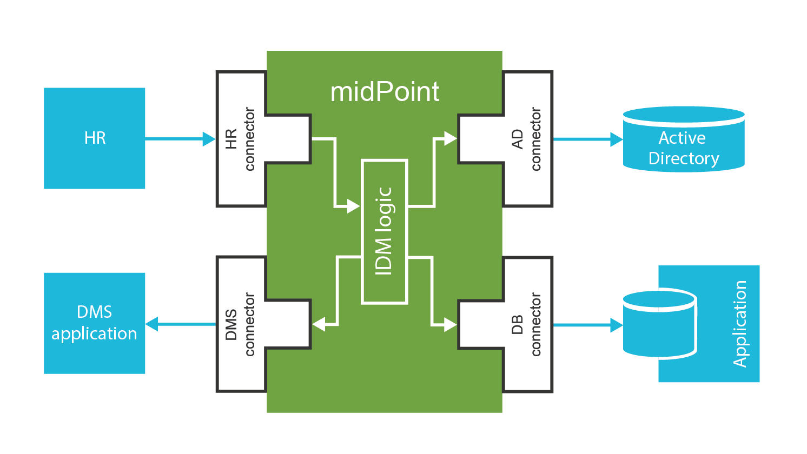
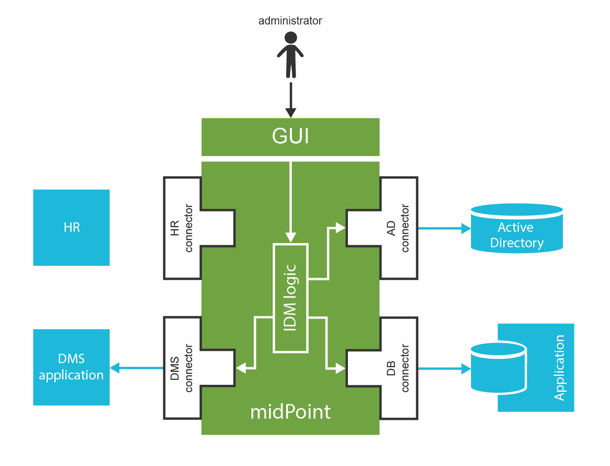
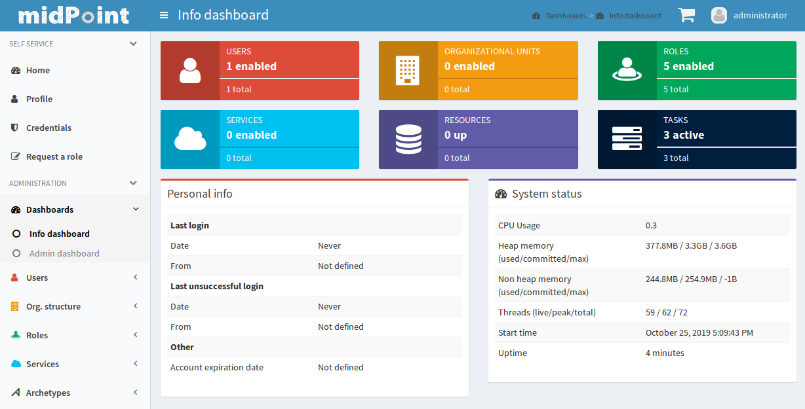
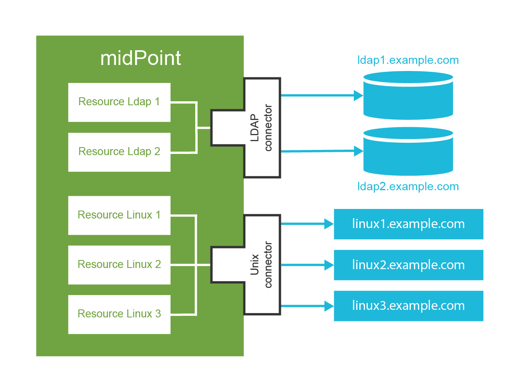
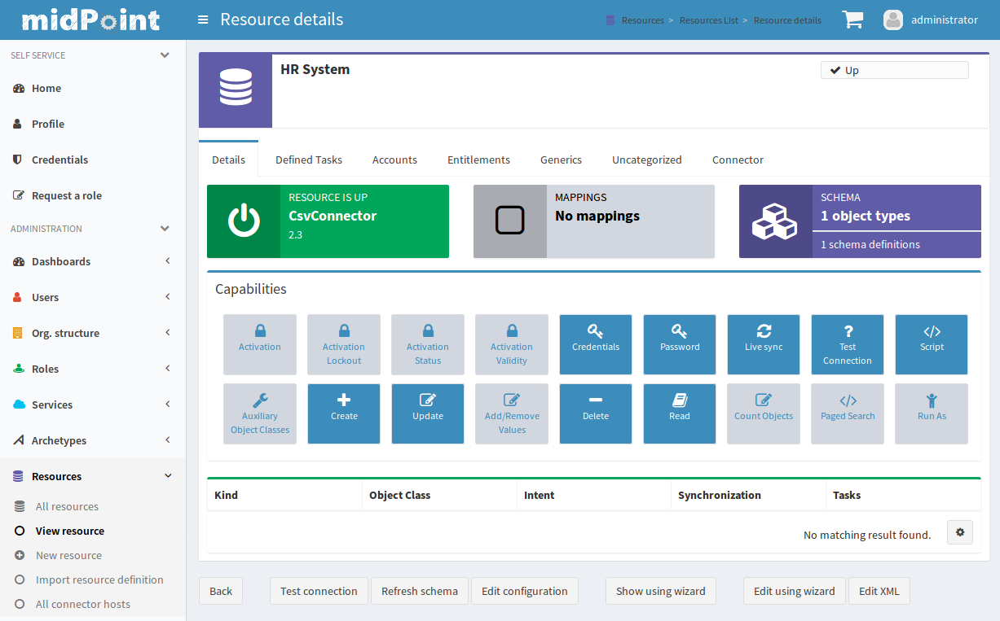

== MidPoint Overview

[quote, Henry Adams]
Chaos was the law of nature; Order was the dream of man.

MidPoint is an open source identity management (IDM) and identity governance system.
It is a very rich and sophisticated system that provides many advanced features.
MidPoint is maintained by Evolveum – a company dedicated to open source development.
All midPoint core developers work for Evolveum.
However, there are also partners and other engineers that are contributing to midPoint development.

MidPoint is a second-generation IDM system.
There are few veterans in midPoint development team that deployed first-generation IDM systems since early 2000s.
That was not always a pleasant experience.
Therefore in 2011 we started midPoint project to correct the mistakes of early IDM systems.
One of the main differences between midPoint and other IDM systems is that midPoint is designed and implemented with one primary goal in mind: to be practical.
We had been dealing (and struggling) with first-generation IDM systems in the past and we do not want to live through that experience again.
Therefore practicality goes very deep into the very foundations of midPoint.
To be more concrete, practicality means:

* Things that are simple or used often should be easy to configure.
Propagation of changed password, user enable/disable, account synchronization – these should be as easy as possible.
As simple as flicking a switch or setting few configuration properties.

* Things that are more complex or used less frequently may be a bit harder.
Such as editing XML or JSON file or writing few lines of Groovy or Python script.

* Things that are very complex or very unusual should be still possible.
However these might not be easy.
It may require longer scripts or implementing some Java classes.
It may require forking and modifying the source code.
But it must be possible to do almost anything.

This means that simple solutions which do not deviate from the usual requirements will be easy to implement.
Most IAM programs start like this.
This approach allows to gain the benefits very early in the project.
The effort grows as the requirements are getting more complex and more unusual.
But the effort is still much lower than implementing everything from scratch.
And there is always an option to stop the project at any point where the costs are getting too high to justify the benefits.
MidPoint is an open source system.
Therefore there is no license cost that would offset the initial costs.
Even small projects are feasible with midPoint.

Simply speaking, midPoint is following the Pareto principle: 20% effort brings 80% benefits.
There are many mechanisms that support this approach.
Some are based in midPoint design, some originate from midPoint development practices and some are even supported by the Evolveum business model.
But more about that later.

=== How MidPoint Works

MidPoint does what any identity management system is supposed to do: it manages identities.
The very basic functionality of midPoint is the synchronization of identity data that are stored in various applications, databases, directory servers, text files and so on.
We call all these systems _resources_.
MidPoint is using _connectors_ to reach the resources.
MidPoint can propagate change that happened in one resource to other resources. E.g. an employee record appears in the HR system, it is picked up by midPoint, processed, transformed and then new Active Directory and CRM accounts are created.
This is the process that we call _synchronization_.

MidPoint has a rich graphical user interface (GUI) that can be used to manage the identities.
Changes made by system administrators are automatically propagated to all affected resources. E.g. security officer disables a user by clicking on disable button in midPoint user interface.
Then MidPoint makes sure that all accounts that belong to the user are immediately disabled.

This is the essence of midPoint operation.
This may sound simple, but this description is extremely simplified.
The reality is much more complicated.
Most of the important things happen inside midPoint before the changes are applied to target resources.
This may look simple at the first sight, but it is not.
For each change that midPoint detects it needs to evaluate:

* *Roles:* MidPoint computes where the user should have access.
This is usually given by the roles that the user has.
The role structure is often quite rich.
There may be hierarchical roles, parametric roles, conditional roles and a lot of other advanced mechanisms.

* *Organizational structure:* Users usually belong to some organizational units, projects, teams or groups.
Some of them may give additional privileges to the user.

* *Status and life cycle:* Accounts can be created, enabled, disabled, archived or deleted.
There are many situations that need to be processed. E.g. we may want to create a disabled account one week before a new employee starts his work, enable the account on his first day, disable the account on his last day and delete it three months after he leaves.

* *Attributes and identifiers:* Simple synchronization scenarios assume that attributes and values will be the same in all the synchronized systems.
That is a nice theory, bit it almost never works like that in real world.
Attribute names need to be translated, values need to be transformed, data types need to be converted.
This is different for each system and even for each instance of each system.
Small algorithms in form of scripting expressions are usually needed to properly transform the values.

* *Credential management:* Password changes need to be propagated to the resources.
Sometimes we want to synchronize password with all systems, sometimes we want just a subset of systems.
Password policies need to be evaluated, password history needs to be checked, password may need to be encoded and hashed before storage.

* *Consistency:* The account in the target application might have changed since midPoint has updated it.
The current change may no longer be applicable to the current state of the account.
The change that midPoint wants to make may conflict with the native change, the change may be partially applied already, the account may have attribute values that it should not have or the account may not exist at all.
MidPoint has to detect such situations are react accordingly, e.g. by re-creating a deleted account before applying the changes.

* *Approvals:* MidPoint determines if any of the changes need to be approved before they are applied.
If that is the case then midPoint drives the request through an approval process.

* *Notifications:* MidPoint notifies the user that he can access a new account.
It notifies the administrator if something goes wrong.

* *Audit:* MidPoint records all the changes into an audit trail.
This can later by used by security officers or specialized analytic engines.

This is a lot of things to process, evaluate and execute.
Some of these steps are quite complex.
And indeed there are many complex algorithms implemented in midPoint.
There are algorithms that evaluate complex role structures, organizational structures, temporal constraints, password policies and so on.
The only thing that is needed is to configure them properly.

However, midPoint does even more than that.
MidPoint does not only manage identities, it can also manage any object that is anyhow related to identity management.
MidPoint can manage roles, role catalogs, organizational structures, groups, projects, teams, services, devices and almost any other object.

MidPoint is also an _identity governance system_.
The job of identity management features is to make sure that the policies are consistently applied through the organization.
The governance features assist with the maintenance and evolution of those policies.
MidPoint implements access recertification process.
This is a recurring process that asks managers to confirm that the users still need the privileges that they have previously received.
MidPoint contains mechanism to sort roles into hierarchies and categories.
That is necessary to maintain order during role engineering and maintenance of role definitions.
MidPoint has mechanisms for selective enforcement of role which comes very useful during migrations and when new system is connected to midPoint.
MidPoint has support for policy lifecycle, general policy rules and so on.
And more work in that direction is planned in future midPoint versions.
We fully understand that it is not enough to simply apply the policies.
Policies are living things and they need to evolve.

=== Case Study

This book is about practical identity management.
Therefore we will get very close to a practice by demonstrating midPoint features using a case study.
This is a case study of a fictional company ExAmPLE, Inc.
The name stands for "Exemplary Amplified Placeholder Enterprise".
ExAmPLE is a mid-sized financial company.
Its operation heavily relies on information technologies, therefore there is a diverse set of applications and information systems ranging from legacy applications to cloud services.
As ExAmPLE has few thousand employees and there is a good potential for growth the management has decided to start an IAM program.
The first step of the program is deployment of midPoint as the identity management system.

Eric is an IT engineer at ExAmPLE. He has taken the responsibility to install and configure midPoint.
Eric spins up a new Linux virtual machine for midPoint.
He downloads midPoint distribution package and follows the installation instructions.
Couple of minutes later midPoint instance starts up.
Eric logs in to the midPoint user interface.

MidPoint instance is almost empty after fresh installation.
It contains only a couple of essential objects.
But Eric is a smart engineer.
He has already read through this book and he knows exactly what he needs to do.

First thing to do is to populate midPoint with employee data.
The primary source of ExAmPLE employee data is an HR system.
The HR system is quite big piece of software and it is not easy to connect to that system directly.
Fortunately, it is quite easy to get a text export of the employee data in comma-separated (CSV) format.
Eric plans to use this file to get employee data to midPoint.

=== Connectors and Resources

MidPoint communicates with all the source and target systems by the means of connectors.
Connectors are relatively small Java components that are plugged into midPoint.
There is usually one connector for each type of the connected system.
Therefore there are connectors for LDAP servers, Active Directory, databases, UNIX operating systems and so on.
The responsibility of a connector is to translate protocols. E.g.
LDAP connector will translate midPoint search commands to LDAP search requests.
The UNIX connector will create an SSH session and translate midPoint create command to the invocation of Linux useradd binary.
And so on.
Each connector talks using its own communication protocol on one side.
But on the other side the connectors translate the information to a common format that is understood by midPoint.

There is no distinction between source and target system when it comes to the connector.
The same connectors are used for source and target systems.
The difference is only in midPoint configuration.

The connectors are distributed as Java binaries (JAR files).
To deploy them to midPoint you just need to place them in the correct directory and restart midPoint.
MidPoint will automatically discover and examine the connectors during start-up.
A handful of frequently used connectors is bundled into midPoint distribution.
These connectors do not need to be deployed.
They are automatically available.

Connector of a specific type works for all the systems that communicate by the protocol supported by connector.
E.g. LDAP connector works for all the LDAP-compliant servers.
Connector is just a very generic piece of code.
It does not know the hostname, port or passwords that are needed to establish a connection to a particular server.
The configuration that specify connection parameters for individual server is stored in special configuration object called _resource_.
The term _resource_ in midPoint terminology generally means any system which is connected to a midPoint instance.

Therefore what Eric the Engineer needs to do to get ExAmPLE employees into midPoint is to define a new resource.
This resource will represent the CSV file exported from the HR system.
MidPoint distribution contains CSV file connector already, therefore there is no need to deploy it explicitly.
All that Eric has to do is to create a new resource definition.
There are (at least) two ways how to do it.
Firstly, there is a configuration wizard in midPoint user interface.
Eric can use the wizard to configure a new resource from scratch.
But as you will see later in this book, the resource definition is quite complex and it has many configuration options.
This makes the configuration wizard very rich and it may be quite confusing for new users.
Therefore it is better for Eric to use the other approach: start from an example.
There are examples of various resource definitions in the midPoint distribution package and even more examples are available on-line.
Therefore Eric quickly locates a XML file that contains a complete example of a CSV resource.
He edits the file to change the filesystem path to his CSV file and adjusts the names of the columns to match the format of his file.
The very minimal resource configuration specifies just the resource name, connector and connector configuration.
The XML file that Eric creates looks approximately like this (simplified for clarity):

[source,xml]
----
<resource oid="03c3ceea-78e2-11e6-954d-dfdfa9ace0cf">
    <name>HR System</name>
    <connectorRef type="ConnectorType"> ...</connectorRef>
    <connectorConfiguration>
        <configurationProperties>
            <filePath>/opt/midpoint/var/resources/hr.csv</filePath>
            <uniqueAttribute>empno</uniqueAttribute>
        </configurationProperties>
     </connectorConfiguration>
</resource>
----

TIP: If you are a hands-on type of an engineer you probably want to follow what Eric is doing in your own midPoint instance.
All the files that Eric is using are provided in a form of ready-to-use samples.
Please see <<additional-information>> chapter at the end of this book for the details.

Then Eric goes to _Configuration_ section of midPoint user interface and imports the XML file into midPoint.
Import operation creates new resource definition in midPoint.
Eric now navigates to _Resources_ section of the midPoint user interface.
The new CSV resource is there.
When Eric clicks on the resource name a resource details screen appears.

Eric can click on the button at the bottom of the screen to test connection to the resource.
As this is a local CSV file there is no real connection.
But the test checks that the filesystem path is correct, that the file exists and that it can be opened.
The test also loads _resource schema_.
MidPoint reads the CSV file header to discover the structure of the data in the CSV file.
The resource is now prepared for use.

There is not much that Eric can do with the resource yet.
We need to explain a couple of essential midPoint concepts before moving forward with our case study.

=== User and Accounts

TODO
