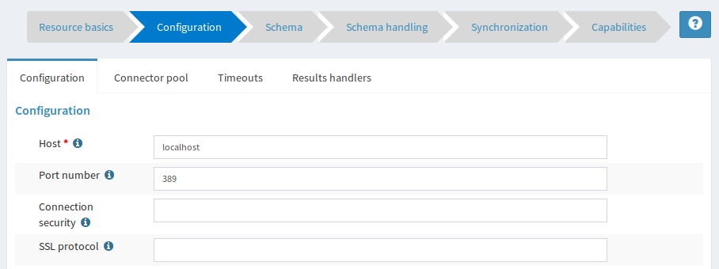
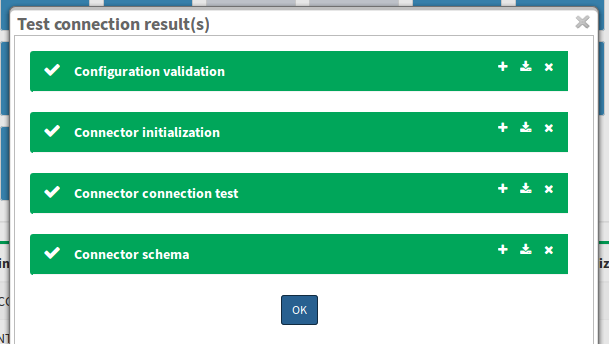
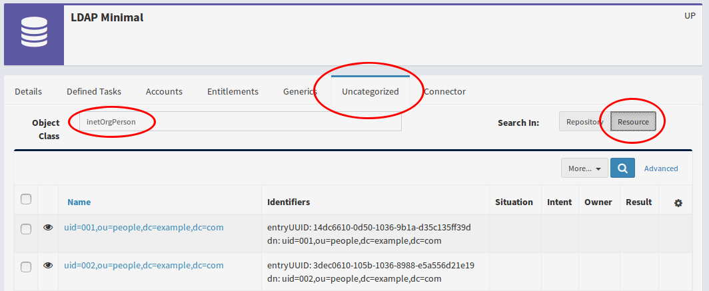
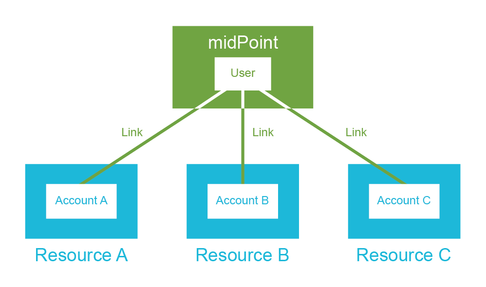
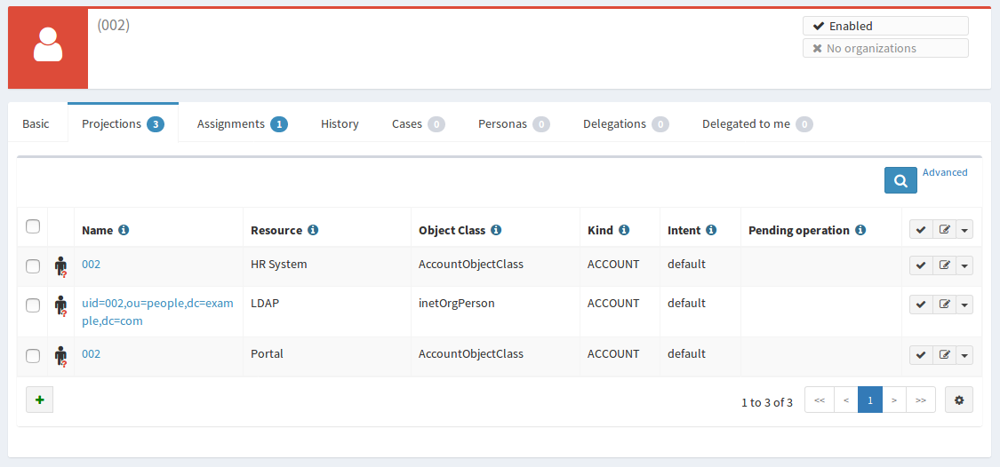
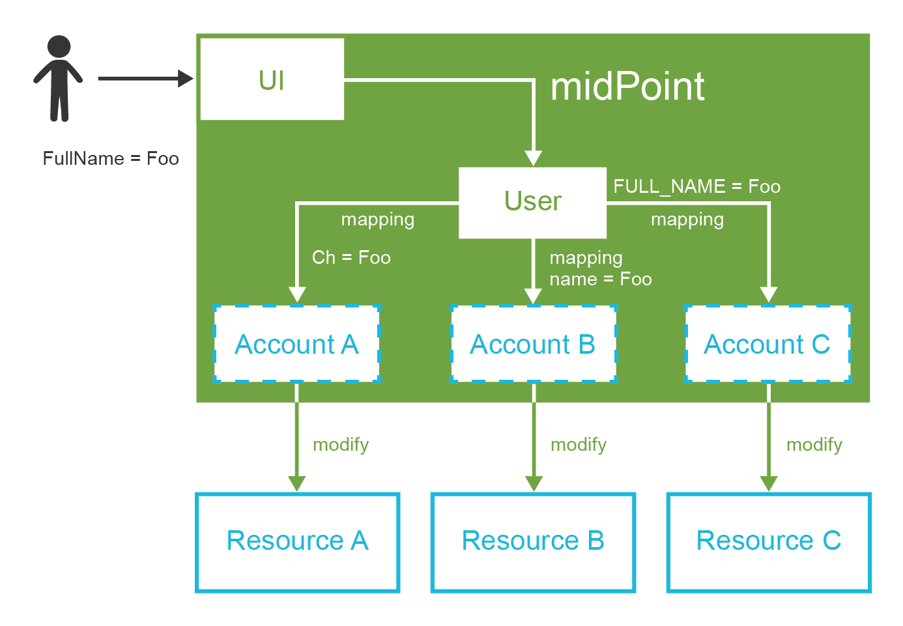
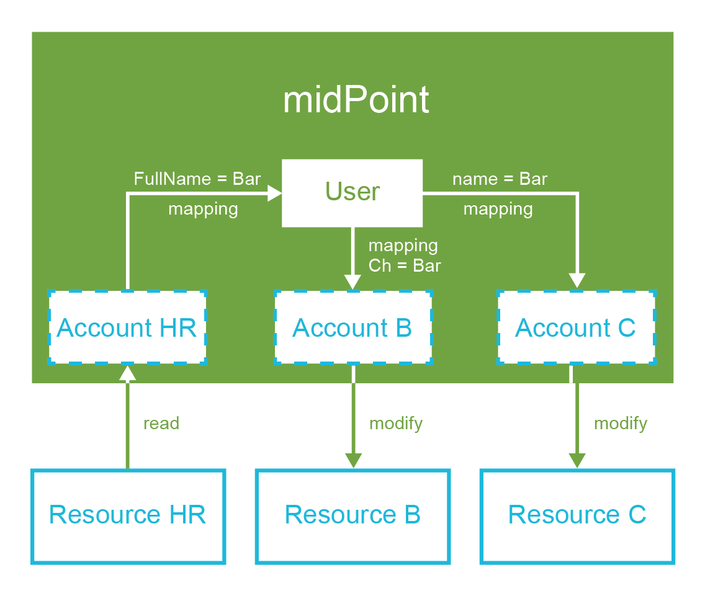
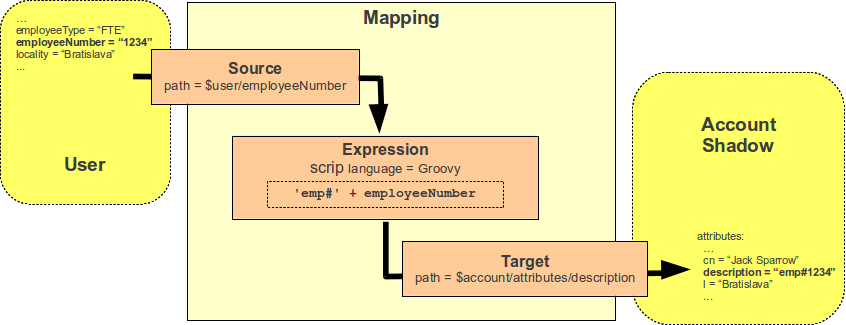
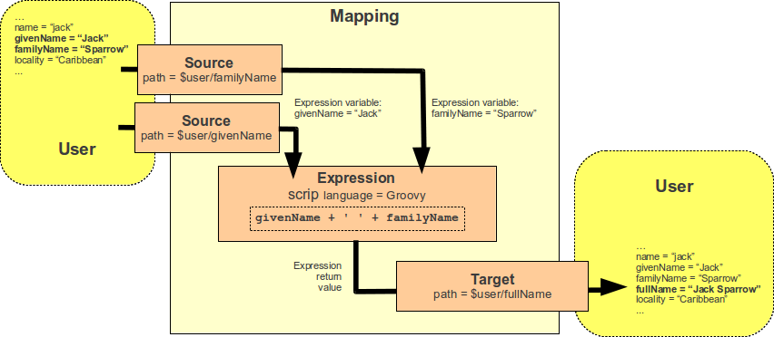

== Resources and Mappings

[quote, William Arthur Ward]
The pessimist complains about the wind; the optimist expects it to change; the realist adjusts the sails.

Reading and writing resource objects, attribute synchronization, mapping of attribute values, their transformation using scripts – these are the basic midPoint features.
These features are absolutely essential for any self-respecting IDM deployment and all IDM engineers should be more than familiar with them.
And this is exactly the purpose of this chapter: describe necessary configuration to use midPoint as a provisioning engine.

It is not very realistic to expect that all the systems will agree on the same interface, communication protocol and schema for identity management.
There were several attempts to unify the IAM landscape, but none of them was entirely successful.
The LDAP protocol was created in 1990s.
But even for such a mature protocol the LDAP implementations are sill not 100% interoperable.
The situation is even worse for identity provisioning protocols.
There were several attempts to specify a standard provisioning protocol, but all of them failed to deliver complete interoperability.
The worst pain point of identity integration is undoubtedly the schema.
Every application has its own data model for representation of accounts, groups, privileges and other identity-related objects.
Even if the application tries to expose that data model using some kind of standard schema there will always be small (but important) differences.
MidPoint provides a practical solution to this problem.
Application interfaces and their schemas need to be aligned or _mapped_ to a common identity schema that you choose to use for your deployment.
This chapter will tell you how to do it.

=== Resource Definitions

_Resource_ is one of the most important concepts in midPoint.
Any system connected to midPoint is a _resource_.
Resources are typically target systems where midPoint manages accounts.
But source systems such as HR databases are also considered to be resources.
There is no strict distinction between source and target resource in midPoint.
Both source and target resources are defined in exactly the same way.
Resource can even act as both source and target at the same time.

MidPoint needs a way how to communicate with the resource.
MidPoint has to know communication protocol, hostname, passwords, etc.
For that purpose midPoint has _resource definition objects_.
These are ordinary midPoint configuration objects stored in midPoint repository.
Resource definition usually contains:

* *Name* of the resource and its description

* *Reference to the connector* which used to communicate with the resource

* *Connector configuration properties* that define resource host name, port, communication settings and so on.
Those properties are used to initialize the connector.

* Definition of *object types* that are interesting for midPoint.
This is typically a definition that describes how a typical account looks like.
But there may be much more: groups, roles, organizational units, …

* Object type definitions typically contain *mappings*.
Mappings define how attributes are synchronized from midPoint to resource or from resource to midPoint.

* *Synchronization* settings that define what midPoint should do if it discovers unknown account, if the account is deleted on the resource and so on.

Resource definition looks like this in its XML form (simplified):

[source,xml]
----
<resource oid="b4101662-7902-11e6-9f14-53e18426fe81">
    <name>LDAP</name>
    <connectorRef oid="028159cc-f976-457f-be70-9e9fa079bcf7"/>
    <connectorConfiguration>
        <configurationProperties>
            <port>389</port>
            <host>localhost</host>
            <baseContext>dc=example,dc=com</baseContext>
            ...
        </configurationProperties>
    </connectorConfiguration>
    <schemaHandling>
        <objectType>
            <kind>account</kind>
            <default>true</default>
            <objectClass>ri:inetOrgPerson</objectClass>
            ...
        </objectType>
    </schemaHandling>
</resource>
----

Resource definition is a very rich (and powerful) configuration object.
It is maybe the richest configuration object in the entire midPoint system.
Creating resource definition from scratch is usually no easy task.
There is a lot of things to consider: connector configuration, identifier conventions, mandatory attributes, attribute value formats and so on.
What we usually do is to locate a resource definition sample for a similar resource.
Then we modify the sample to suit our needs.
However, you need to understand how the resource definitions work to do this efficiently.
Next few sections will explain the structure and function of resource definitions.

Believe it or not, there are people that do not like XML/JSON/YAML. There are also people that really want to start creating the resource from scratch.
For all those people there is a resource wizard in the midPoint user interface.
The wizard can be used to create and edit resource using a graphical user interface.

However, even if resource wizard is your preferred way, it may be still easier to start with an existing sample.
Find the sample that is the best match for your situation, import it in midPoint and then use the wizard to modify it.

There are many resource samples to start from.
Most of them are located in midPoint distribution package.
But there are other places to look for samples.
Please see <<additional-information>> chapter for suggestions.

=== Connectors

Every resource needs a connector to work.
Connectors are small pieces of Java code that are used to communicate with the resource.
MidPoint looks for available connectors when it starts up.
MidPoint will automatically create new configuration object for each connector that it discovers during startup.
The list of discovered connectors can be seen in midPoint user interface in _Configuration > Repository objects > Connector_.
The connector objects look like this:

[source,xml]
----
<connector oid="028159cc-f976-457f-be70-9e9fa079bcf7">
  <name>ConnId com.evolveum.polygon.connector.ldap.LdapConnector v2.0</name>
  <framework>http://midpoint.evolveum.com/xml/ns/public/connector/icf-1</framework>
  <connectorType>com.evolveum.polygon.connector.ldap.LdapConnector</connectorType>
  <connectorVersion>2.0</connectorVersion>
  <connectorBundle>com.evolveum.polygon.connector-ldap</connectorBundle>
  <namespace>http://midpoint.evolveum.com/xml/ns/…</namespace>
  <schema>
      ...
  </schema>
<connector>
----

The resource definition needs to point to the appropriate connector object.
Therefore select the right connector from the connector list and remember its OID. Then use the connector OID in the resource configuration like this:

[source,xml]
----
<resource>
    <name>My LDAP Server</name>
    <connectorRef oid="028159cc-f976-457f-be70-9e9fa079bcf7"/>
    ...
</resource>
----

This is a straightforward way how to link connector and resource.
However, it is not the most convenient one.
MidPoint creates connector objects automatically.
Therefore the OIDs of the connector objects are not fixed.
Every midPoint instance will have different OID for the discovered connectors.
Therefore if we want a resource that is always using the LDAP connector in all the midPoint instances we cannot do that by just using OIDs.
But there is another way.
You can use search filter instead of fixed OID:

[source,xml]
----
<resource>
    <name>My LDAP Server</name>
    <connectorRef type="ConnectorType">
        <filter>
           <q:equal>
               <q:path>connectorType</q:path>
               <q:value>com.evolveum.polygon.connector.ldap.LdapConnector</q:value>
           </q:equal>
        </filter>
    </connectorRef>
    ...
</resource>
----

The detailed explanation of the search filters will come later.
For now it is important to know just few basic principles.
When this resource definition is imported, midPoint notices that there is no OID in the `connectorRef` reference.
It also notices that there is a search filter.
Therefore midPoint executes that search filter.
In this case it looks for object of `ConnectorType` type that has property `connectorType` with value `com.evolveum.polygon.connector.ldap.LdapConnector`.
Therefore midPoint finds LDAP connector regardless of the OID that was generated when midPoint discovered that connector.
Then midPoint takes the OID of the object that it has found.
The OID is placed to the `connectorRef` reference, so midPoint can find the connector directly and it does not need to execute the search every time the resource is used.

This is the method that is frequently used to bind resource definition to a specific connector type.
It has the advantage that it works in all midPoint deployments.
Therefore it is also used in configuration the samples.

=== Bundled and Deployed Connectors

Each class of resources needs its own connector.
There is an LDAP connector that supports all the common LDAP servers.
There are connectors that work with generic database tables.
These connectors are quite generic.
But most connectors are built for a specific application or software system: Linux servers, SAP R/3, Siebel, etc.

There is a handful of connectors that are so generic that they are used in almost all midPoint deployments.
These connectors are bundled with midPoint.
That means that they are part of the midPoint application package and they are always available.
These three connector bundles are part of midPoint:

* LDAP Connector bundle, which contains:
** *LDAP* connector that works with most LDAPv3-compliant servers.
** *Active Directory* connector that can work with Microsoft Active Directory over LDAP protocol.
* *DatabaseTable* connector bundle with a connector that can connect to a generic relational database table.
* *CSV* connector bundle with a connector that works with comma-separated (CSV) text files.

These connectors are always available in midPoint.
Other connectors must be deployed into midPoint.
Connector deployment is a very straightforward process:

. Locate the connector binary (JAR file).

. Copy the binary into the `icf-connectors` directory which is located in midPoint home directory.

. Restart midPoint

MidPoint will scan the `icf-connectors` directory when it starts up.
It will discover any new connectors and create a connector configuration objects for them.

=== Connector Configuration Properties

Connector need a configuration to be able to work with resource.
This configuration usually consists of connection parameters such as hostname, port, administrative username, password, connection security settings and so on.
The connector configuration properties are specified in resource definition object.
In a simplified from it looks like this:

[source,xml]
----
<resource oid="b4101662-7902-11e6-9f14-53e18426fe81">
    <name>My LDAP Server</name>
    <connectorRef oid="028159cc-f976-457f-be70-9e9fa079bcf7"/>
    <connectorConfiguration>
        <configurationProperties>
            <port>389</port>
            <host>localhost</host>
            <baseContext>dc=example,dc=com</baseContext>
            ...
        </configurationProperties>
    </connectorConfiguration>
    ...
</resource>
----

There may be a very broad range of configuration properties - and every connector has its own set.
While working just with the text representation of the resource definition you will need to find out the names of the configuration properties by looking at the samples, connector documentation or maybe even connector source code.
It may look difficult but this is perfectly viable approach.
However, there are other ways.
Firstly there is the resource wizard.
The wizard knows all the connector configuration properties and it will present the properties in a configuration form.
The wizard takes the definition of the configuration properties from _connector schema_.
Connector schema is a definition of the properties that the connector supports: their names, types, multiplicity and so on.
The connector schema is stored in the connector configuration object under the schema tag.
Therefore even if you are working only with the XML/JSON/YAML files you can have a look at that schema to figure out what connector configuration properties are supported.

The connector schema also defines connector namespace.
Generally speaking namespaces in midPoint are used to isolate schema extensions that might conflict and they are also used for data model versioning.
The use of namespaces is optional in almost all parts of midPoint - but not yet in all the parts.
Connector configuration is one of the few parts where namespaces should still be used.
And it also makes some sense, as namespaces are used here as an additional safety mechanism.
To keep a long story short, the configuration properties should be properly namespace-qualified:

[source,xml]
----
<resource oid="b4101662-7902-11e6-9f14-53e18426fe81">
    <name>LDAP</name>
    <connectorRef oid="028159cc-f976-457f-be70-9e9fa079bcf7"/>
    <connectorConfiguration
       xmlns:icfc="http://⁠midpoint.evolveum.com/⁠xml/⁠ns/⁠public⁠/⁠connector⁠/⁠icf⁠-⁠1⁠/⁠connector-schema-3"
       xmlns:icfcldap="http://midpoint.evolveum.com⁠/⁠xml⁠/⁠ns⁠/⁠public⁠/⁠connector⁠/⁠icf⁠-⁠1⁠/⁠bundle⁠/⁠com.evolveum.polygon.connector⁠-⁠ldap/⁠com.evolveum.polygon.connector.ldap.LdapConnector">
        <icfc:configurationProperties>
            <icfcldap:port>389</icfcldap:port>
            <icfcldap:host>localhost</icfcldap:host>
            <icfcldap:baseContext>dc=example,dc=com</icfcldap:baseContext>
            ...
        </icfc:configurationProperties>
    </connectorConfiguration>
    ...
</resource>
----

The use of namespaces will be completely optional in later midPoint versions.
For now just copy the namespace URIs from the samples.
You do not have to completely understand what is going on.
Just one thing: the namespace of the configuration properties should be the same as the namespace defined in the connector object.
This is a long URI that is composed from connector bundle name and connector name. E.g.

`http://⁠midpoint.evolveum.com/⁠xml/⁠ns/⁠public/⁠connector/⁠icf-⁠1/⁠bundle/⁠com.evolveum.polygon.connector-⁠ldap/⁠com.evolveum.polygon.connector.ldap.LdapConnector`

If the namespace does not match then the connector will refuse to work.
This is a safety mechanism that prohibits accidental use of configuration from one connector in another connector where the configuration properties may have the same name but a completely different meaning.

=== Testing the Resource

Minimal resource definition has just the name, connector reference and connector configuration properties.
After that the resource should show the first signs of life.
Therefore select a suitable sample file now.
Strip it down to the minimum, modify connector configuration properties and import the resource into midPoint.
You should be able to see your resource in the list in _Resources > List resources_.
The icon next to your resource is most likely black - not green and not red.
Green icon means that the resource is working, red icon means that there is an error, black means "I do not know yet".
Click on the resource label.
Resource details page should appear.
There is a _Test Connection_ button at the bottom of the page.
Click on that button.
It may take a while now.
MidPoint is initializing the connector with the configuration properties that you have specified.
Then the connector will be used to check connection to the resource.
If the parameters were correct and midPoint can reach the resource you will see green lights:

If there are any errors during connector initialization, configuration or network connection you will see the errors here.
In that case correct the configuration properties and try again.
If everything works well then the resource icon turns green.
Now we have a minimal working resource.

There are few more things that you can do with such a minimal resource.
For example you can look at the resource content.
Navigate to the resource details page and switch to _Uncategorized_ tab.
Select one of the object classes that the resource supports.
Just click inside the _Object class_ input box and the suggestions will appear.
Now click on the _Resource_ button on the right side.
MidPoint connects to the resource, lists all the objects of the given object class and displays the list.
Now you can click on any object to see the details.

That is a very useful feature for several reasons.
Firstly, you can check that not just the resource connection works, but that the connector can actually retrieve the objects.
Secondly, you will get some idea about the object classes that the resource supports.
And thirdly, by looking at several objects you can get basic overview of how the data are structured: what attributes are used and what are the typical values.
You will appreciate that information later on when we will be setting up mappings.

=== Resource Schema Basics

The only resource object that early identity management systems dealt with was an _account_.
That is not sufficient any more.
Good identity management system needs to manage may different types of resource objects: accounts, groups, organizational units, privileges, roles, access control lists and so on.
In midPoint these are the _object classes_: types of resource objects that are made accessible to midPoint by the connector.
A minimal resource supports at least the _account_ object class, but a typical resource supports more object classes.
Each object class may have a completely different set of attributes: different names, different types, some may be mandatory, some optional.

The collective definition of the object classes and their attributes is what we call _resource schema_.
Obviously, resource schema is different for every resource.
Even resources that are using the same connector may have different resource schema (e.g. two LDAP servers with different custom schema extensions).
MidPoint is a smart system and it is capable of automatic resource schema discovery.
MidPoint will reach out to the resource and retrieve the schema when the resource is used for the first time.
Retrieved resource schema is stored under the schema tag in resource definition object.
You can have a look and examine the schema there.
But beware, the schema may be quite rich and big.

Resource schema is absolutely crucial concept.
MidPoint takes advantage of resource schema whenever it needs to work with resource objects such as accounts or groups.
MidPoint uses resource schema to validate mappings.
The schema is used for automatic type conversions.
And most importantly of all: resource schema is used to display resource objects in user interface.
MidPoint adapts to resource schema automatically.
Not a single line of custom code is needed to do that.

=== Hub and Spoke

MidPoint topology is a star (a.k.a. "hub and spoke") with midPoint at the center.
This is both physical and logical topology of midPoint deployments.

This means that the _account A_ can be synchronized with midPoint user and then midPoint user can be synchronized with _account B_.
But _account A_ cannot be synchronized directly to _account B_.
This is deliberate decision that was made very early in midPoint design and we have very good reasons for it.

_Accounts_ and user that represent the same person are _linked_ together.
This _link_ is a relation that midPoint creates and maintains.
Therefore midPoint knows who is the owner of a particular account.
MidPoint also knows which accounts the user has.
That is how midPoint knows which account needs to be synchronized with which user.
It is critical for the links to be correct otherwise midPoint cannot reliably synchronize the data.
Therefore midPoint takes great care to maintain the links.
And that is not always an easy task.
There are strange corner cases such as renamed accounts or accounts that were deleted by mistake and re-created.
But midPoint is built to handle such cases.
The links are always maintained.
And it is the link that allows midPoint to list all user’s accounts in the user interface.

The user in midPoint is known as _focus_ in midPoint terminology.
The accounts are known as _projections_.
You can imagine a light projector that sends many light beams from its focal point to create a projection on the screen.
This is the metaphor that we have chosen when building midPoint.
And for the lack of better words this terminology remains in use even now.
We will get back to the concept of focus and projections many times in this book.
For now you just need to remember that _projection_ means an _account_.

MidPoint knows which account belongs to which user by following links that it maintains.
But how does midPoint know which attributes to synchronize?
How to transform the values?
And which side is the authoritative one?
Mappings take care of that.
Mapping is like a flexible data replication recipe.
MidPoint allows to define mappings for each attribute in any direction.
The mappings are used to control the synchronization on a very fine granularity.

Perhaps the best way to summarize synchronization principles is to illustrate them using a couple of examples.
The first example is a modification of user properties in midPoint user interface.
When the Save button is pressed then midPoint user interface sends the modification to midPoint core engine.
The synchronization code in midPoint core follows the links to find all the accounts that belong to this specific user.
Then the mappings are applied to synchronize the changed user properties to the accounts.
Account changes are propagated to the resources and user changes are stored in midPoint repository.

The second example is slightly different.
This case starts with a change of account data.
This may be a change of an employee record in HR system.
MidPoint detects that change and reads the changed account.
MidPoint follows the link to find the user to which the account belongs.
Then it follows other links from the user to find all the other accounts that may be affected.
Similarly to the previous case the mappings are applied.
The mappings from the HR account to the user are applied first.
The result is a modification of user properties.
Then an process identical to the previous case takes place.
User modifications are automatically applied to all affected accounts.

Those two cases look to be quite different.
First case is a manual change of data by system administrator.
Second case is an automatic data feed from the HR system.
But as you can see the principles that are used to implement those two cases are almost exactly the same.
This is the consequence of midPoint philosophy: radical reuse of functionality and generic application of principles.
You just need to define what you want to do (the policy).
MidPoint takes care that it is done when it needs to be done.

TIP: Why the star topology?
The star or "hub and spoke" were (and still are) the big buzzwords of system integration.
And the basic idea makes a lot of sense.
If every node needs to be synchronized with every other node then the number of required connections grows quite steeply.
It is in fact proportional to the square of the number of nodes.
Mathematicians say that is has O(n^2^) complexity.
However, if you rearrange the connections so that they all point to the central "hub" then the number of connections is significantly reduced.
It is proportional to the number of nodes: O(n) complexity.
This is a huge difference, especially in deployments with many resources.
However, this approach works well only if the star topology is both physical and logical.
I.e. it makes very little sense to connect all resources to a central “hub” if that hub still internally needs O(n^2^) policies to synchronize the data.
That would only hide the complexity in a black box, but the complexity is still there.
However, midPoint is different.
MidPoint is a real "hub".
This is the reason why midPoint does not support synchronization of accounts directly with each other.
We want to have simple, clean and maintainable system, both externally and internally.

=== Schema Handling

Resource schema is a very important concept.
It defines what object classes are supported by the resource and how they look like.
But it is not important to know only how the objects look like.
It is also important to know what to do with them.
And that is what the _schema handling_ is all about.

_Schema handling_ is a part of resource definition object.
It specifies which object classes from the resource schema are actually used by midPoint.
And most importantly of all it specifies how they are used.
This is the place where mappings are stored.
This is the place where account-group associations are defined.
This is the place where schema can be augmented and tweaked.
Simply speaking, this is the place where most of the resource-related configuration takes place.

_Schema handling_ section contains definition of several _object types_.
Each _object type_ refers to one "thing" that midPoint works with: default account, testing account, group, organizational unit and so on.
Let’s start with something simple and let’s define just one object type now: default account.
It looks like this:

[source,xml]
----
<resource oid="b4101662-7902-11e6-9f14-53e18426fe81">
    <name>My LDAP Server</name>
    ...
    <schemaHandling>
        <objectType>
            <kind>account</kind>
            <default>true</default>
            <objectClass>ri:inetOrgPerson</objectClass>
        </objectType>
    </schemaHandling>
</resource>
----

This may seem trivial, but even such a minimal definition is important for midPoint.
This definition tells midPoint that default account on this resource has `inetOrgPerson` object class.
Resources such as LDAP servers may have dozens of object classes.
Most of them are not used at all.
There are often several alternative object classes that can be used to create accounts.
It is important to tell midPoint which object class is the right one.
And that’s what this definition does.
Once this definition is in place, the accounts appear on the _Accounts_ tab of the resource details page (they were visible only on the _Generics_ tab before).
This is a sign that the definition works correctly.

A clever reader surely noticed definition of _kind_ in the above example.
Setting _kind_ to `account` indicates that this object type definition represents (surprisingly) an account.
MidPoint supports many types of objects.
But two types have a special place: _accounts_ that represents the users and _entitlements_ that give privileges to accounts.
MidPoint can handle the objects in a smart way if it knows that it is either account or entitlement.
And the _kind_ definition tells just that.
There is also optional _intent_ setting that can be used to define subtypes.
But more on that later.

The schema handling section can also be used to augment (or even override) some parts of the resource schema.
E.g. following example sets a display name for this object type.
The display name will be used by the user interface when it displays the account.

[source,xml]
----
<resource oid="b4101662-7902-11e6-9f14-53e18426fe81">
    <name>My LDAP Server</name>
    ...
    <schemaHandling>
        <objectType>
            <kind>account</kind>
            <displayName>Default account</displayName>
            <default>true</default>
            <objectClass>ri:inetOrgPerson</objectClass>
        </objectType>
    </schemaHandling>
</resource>
----

However, the most powerful feature that is used in the schema handling is the ability to deal with attributes.
Following sections are all about that.

=== Attribute Handling

Resource objects such as accounts or groups are mostly just a bunch of attributes.
Almost all of the IDM magic is about setting the correct attribute to the correct value.
The schema handling section of the resource definition is the place where the basic attribute behavior is defined.

The object type definition contains sections that define behavior of each attribute that we care about:

[source,xml]
----
<resource oid="b4101662-7902-11e6-9f14-53e18426fe81">
    <name>My LDAP Server</name>
    ...
    <schemaHandling>
        <objectType>
            <kind>account</kind>
            <default>true</default>
            <objectClass>ri:inetOrgPerson</objectClass>
            <attribute>
                <ref>ri:dn</ref>
                <!-- behavior of "dn" attribute defined here -->
            </attribute>
            <attribute>
                <ref>ri:cn</ref>
                <!-- behavior of "cn" attribute defined here -->
            </attribute>
            ...
        </objectType>
    </schemaHandling>
</resource>
----

There is an `attribute` element for every attribute that we need.
Lot of details can be defined here: display name of the attribute that will be used by the user interface, limitations and schema augmentation, override settings and so on.
But the most important things that go there are the mappings.
In the simplest form a mapping looks like this:

[source,xml]
----
<resource oid="b4101662-7902-11e6-9f14-53e18426fe81">
    <name>My LDAP Server</name>
    ...
    <schemaHandling>
        <objectType>
            <kind>account</kind>
            <default>true</default>
            <objectClass>ri:inetOrgPerson</objectClass>
            ...
            <attribute>
                <ref>ri:cn</ref>
                <outbound>
                    <source>
                        <path>$focus/fullName</path>
                    </source>
                </outbound>
            </attribute>
            ...
        </objectType>
    </schemaHandling>
</resource>
----

This means that the value of the cn attribute will be taken from the `fullName` property of the focal object (which is typically a user).
This a very simple mapping, there is no value transformation, no condition – nothing complicated at all.
This is how a lot of mappings look like.
But mappings can also be very powerful and complex.
That will be described in next section.

The `attribute` sections are used to set up the attributes that a typical user account on the resource has.
Those will assign identifiers, set up full name, set description and telephone number attributes and things like that.
It is a very convenient approach to have this directly in the resource definition.
We can simply assign the accounts to the user without specifying any details.
MidPoint evaluates the mappings in `attribute` sections to populate account attributes with the correct values.
Now it is perhaps a good time to have a look at some sample resource definitions to get a feel how a real-world resource definition looks like.
The samples are located in the midPoint distribution package or you can find them on-line.
See <<additional-information>> chapter for more details.

TIP: The "ri" namespace.
You may have noticed that "ri" namespace prefix is used whenever we refer to the object classes or attributes.
In a strict sense this is the correct notation.
Object classes and attributes are defined in resource schema and the "ri" is the namespace of that schema.
While the use of namespaces should be optional in almost all parts of midPoint, we are still using the "ri" namespace in samples.
Mostly due to the nostalgic reasons.
By the way, "ri" stands for "resource instance".

=== Mappings

Mapping is a very flexible mechanism that takes one or more input properties, transforms them and puts the result in another property.
Mappings are used all over midPoint.
But perhaps the most important use of mappings is in the schema handling part of the resource definition where they set up account attribute values.
We have already seen a very simple mapping that simply copies the values from one place to another.
Now it is the time to look at mapping in its entirety.

Mapping consists of the three basic parts:

* *Source* part defines the data sources of the mapping.
These are usually understood as mapping input variables.
Source defines where mapping gets its data from.

* *Expression* part defines how the data are transformed, generated or passed on to the "other side".
This is the most flexible part of the mapping as it contains the logic.
There is a broad variety of possibilities, including support for scripting expressions.

* *Target* part defines what to do with the results of the mapping, where the computed values should go.

The three parts of the mapping as well as the basic principle is illustrated in the following diagram:

The diagram shows a mapping that takes `employeeNumber` user property and transforms it to `description` account attribute by using a simple Groovy script expression.

The `source` part of the mapping defines that there is a single source which is based on `employeeNumber` user property.
Source definitions are important for the mapping to correctly process relative changes (deltas), mapping dependencies, etc.
The source definition tells mapping that the value of `employeeNumber` user property should be passed to an expression.

The `expression` part contains a simple Groovy script that prepends the prefix `emp#` to the employee number value specified by the source definition.
The `expression` part of the mapping is very flexible and there is a lot of ways that can be used to transform a value, generate new value, use a fixed value, pass a value without any change and so on.

The `target` part defines how the result of the expression should be used.
In this case the result is to be used as a `description` account attribute.
The `target` definition is necessary so the mapping can locate appropriate definition of the target property and therefore make sure that the expression produces a correct data type and that other schema constraints are maintained (e.g. single vs multiple values).

This mapping can be expressed in XML:

[source,xml]
----
<mapping>
    <source>
        <path>$focus/employeeNumber</path>
    </source>
    <expression>
        
    </expression>
    <target>
        <path>$projection/attributes/description</path>
    </target>
</mapping>
----

Not all parts of the mapping are mandatory.
If the expression is not present then "as is" expression is assumed.
Such expression simply copies the source to target without any transformation.
Some parts of the mapping may be implicitly defined by the surrounding context. E.g. target or source is implicit if the mapping is used to define attribute behavior in the schema handling section.
Therefore it is usually sufficient to define either source or target for mappings in `schemaHandling`:

[source,xml]
----
<schemaHandling>
    ...
    <attribute>
        <ref>ri:sn</ref>
        <outbound>
             <source>
                  <path>$focus/familyName</path>
            </source>
        </outbound>
    </attribute>
    ...
</schemaHandling>
----

This is the notation that you have seen in the previous section.
Mapping source is explicitly specified as the `familyName` property of the user.
Mapping target is implicitly set to be the attribute for which the mapping is defined.
As no expression is explicitly defined it defaults to a simple copy of the value without any transformation (`asIs`).

Mapping notation can even be shortened a bit more in this case.
It is quite clear that the mapping source will be one of the properties of the focal object (user).
Therefore the `$focus` prefix can be omitted:

[source,xml]
----
<schemaHandling>
    ...
    <attribute>
        <ref>ri:sn</ref>
        <outbound>
            <source>
                 <path>familyName</path>
            </source>
        </outbound>
    </attribute>
    ...
</schemaHandling>
----

Those examples are still very simple.
Mappings can do much more – as you will learn later on.
But there is one more thing that we need to explain here.
Mappings are designed to work with more than just a single source.
Following diagram illustrates a mapping that takes two arguments: given name and family name.
The mapping produces full name by concatenating these value with a space in between.
This is the kind of mapping that is frequently used to construct user’s full name from its components.
While the mapping may seem simple there are some sophisticated mechanisms hidden inside.

The mapping is represented in the XML form as follows:

[source,xml]
----
<mapping>
    <source>
        <path>givenName</path>
    </source>
    <source>
        <path>familyName</path>
    </source>
    <expression>
        
    </expression>
    <target>
        <path>fullName</path>
    </target>
</mapping>
----

There are two sources specified by the source definitions: user property `givenName` and another user property `familyName`.
The mapping is using _script expression_ to combine the values into a single value which is used to populate user's `fullName` property.

This example also illustrates that the mappings are smart.
The mapping may be evaluated only if one of the sources changes or if a full recompute is requested.
In case that neither `givenName` not `familyName` changes there is no need to re-evaluate that expression.
This is one of the reasons for requiring explicit source definition in the mappings.
Without such definitions it is not (realistically) possible to reliably determine when and how the expression should be re-evaluated.

TIP: Variables `$focus` and `$projection` were introduced in midPoint 3.0 as a consequence of the generic synchronization feature.
The objects that the expression works with might not be just user or account.
A much broader range of objects may be used.
Therefore generic concepts of focus and projections were introduced and the variable names were changed to reflect that.
The old variables `$user` and `$account` can still be used, but their use is deprecated.
Despite that they are still used in some older examples.
It is never easy to completely eliminate the burden of history, is it?

Mappings are used all over midPoint, in many places and situations.
Sometimes a mapping needs to be really authoritative.
It has to enforce the value to the target.
But sometimes we want to provide a default value and the mapping should never change the target value once it is set.
Therefore mapping can be set to various levels of _strength_: from weak to strong.
Following table describes how that works:

|===
|Strength |Description

|`weak`
|Mapping is applied only if the target has no value.
Weak mappings are usually used to set _default values_.

|`normal`
|Mapping is applied only if there is a change in source properties.
Normal-strength mappings are used to implement the _last change wins_ strategy.
If the value was modified in midPoint then the mapping is applied and target is modified.
If the target is modified directly then the mapping does not overwrite the target value – until the next change in midPoint.
This is the default behavior of mappings.
If no strength is specified then `normal` is assumed.

|`strong`
|Mapping is always applied.
Strong mappings _enforce_ particular values.
|===

The strength can be specified in any mapping by using the `strength` tag:

[source,xml]
----
<attribute>
    <ref>ri:sn</ref>
    <outbound>
        <strength>strong</strength>
        <source>
             <path>$focus/familyName</path>
        </source>
    </outbound>
</attribute>
----

When it comes to mapping strength then the following rule of the thumb may be useful: If you want to enforce policy use _strong_ mappings.
If you just want to set a default value use _weak_ mapping.
If you are not sure what you are doing then _normal_ mappings will probably work just fine.

=== Expressions

TODO
